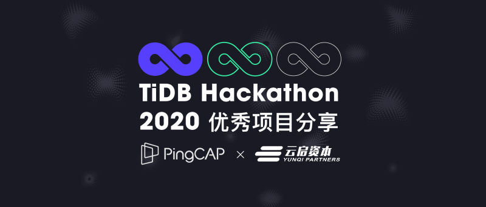
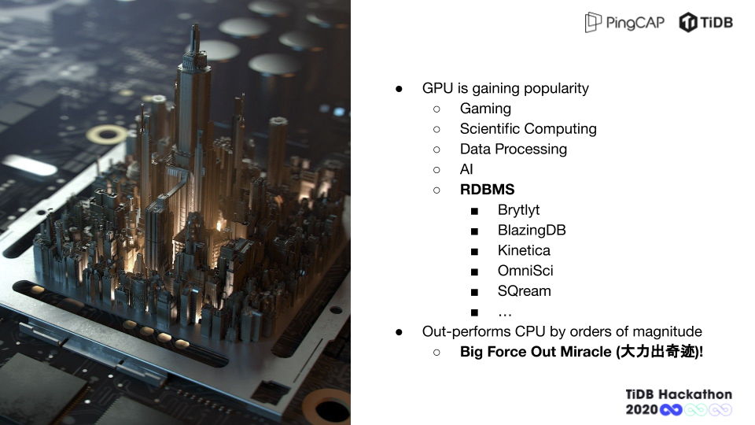
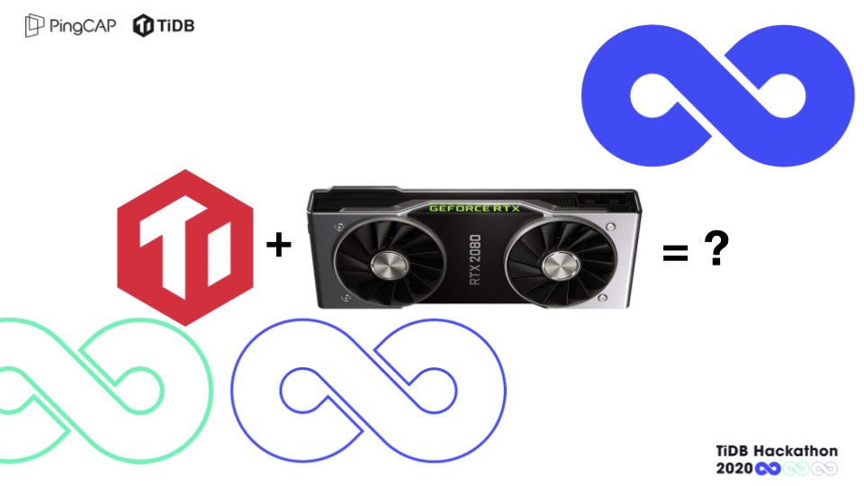
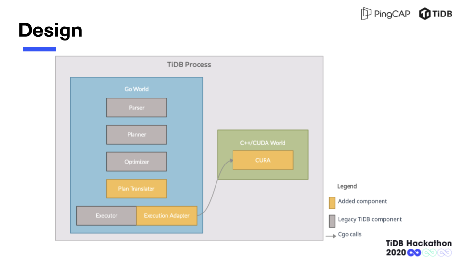
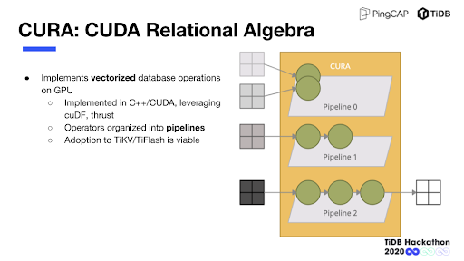
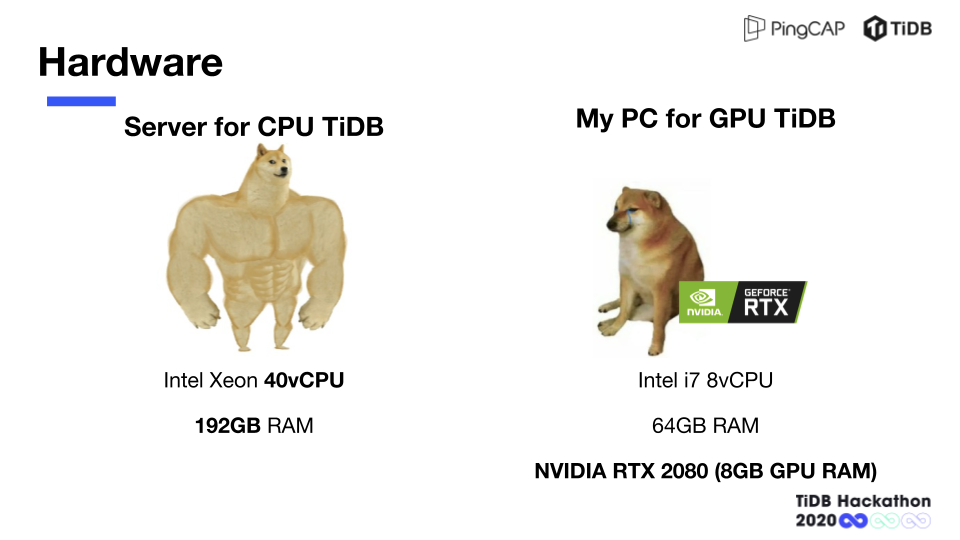
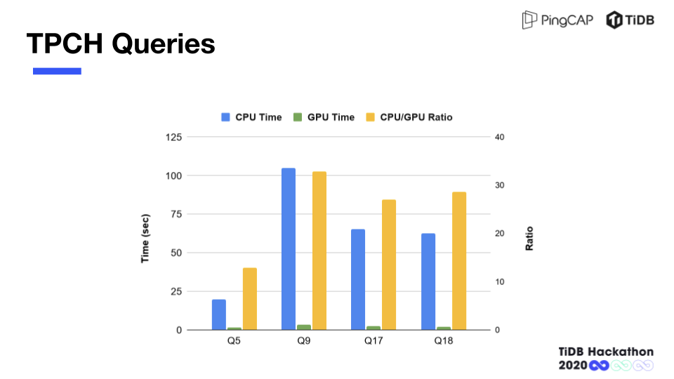

Mods 团队的两位成员孙若曦、徐飞相识已久，笑称对方为「 最默契的人 」。在本次Hackathon 中他们使用 GPU 加速技术，为 TiDB 带来新的扩展性提升。该项目最终获得三等奖和云启资本 — 最具市场潜力奖。今天我们将分享作为决赛第一组进行答辩的 Mods 团队与云启资本合伙人陈昱的访谈 ，探秘三位工程师（陈昱此前曾是 Google 的工程师，曾和 Spanner 论文其中一个作者坐在同一格子间里）关于 「 GPU 加速 TiDB 的紧张故事 」。

## Q：Mods 团队的名字的由来和组队趣事儿？

**Mods ：** 我们队伍的两个人都是毕业就进入 N 厂（英伟达），一起在上海的 GPU Mods 组，后来又都进入了 P 社（ PingCAP）。这次我们想做一个 GPU 加速的项目，索性就直接用了 Mods 这个队名。

## Q：很好奇，英伟达大家都会去做偏 AI 的东西，当时为什么会加入一家数据库公司？

**Mods ：** 加入 PingCAP 的原因是我们都认为大数据和数据库市场的前景是比较广的，而且我们在英伟达更多的也是做一些偏底层、偏基础设施方面的工作，我们觉得这方面的经验是有可能被应用到同样是基础软件的大数据和数据库这方面的工作上的，因此就做了这样的选择。

## Q：陈昱老师也是工程师出身，最终选择 Mods 团队的原因有哪些？

**云启资本陈昱：** 早在 2017 年，我就关注 GPU 加速的应用，在我看来用 GPU 来加速数据分析，是蛮有商业价值的。

除了这个项目的 idea 我很喜欢之外，从投资人的角度来看，我更看中项目的独立性。比如本次获得第一名的 UDF 的项目我也很喜欢，但是它需要依附 PingCAP 的生态，比较难独立孵化，当然在生态里实现也很不错，但是从投资人的角度考虑，会更希望有朝一日可以孵化出一个独立的公司。

## Q：陈昱老师之前应该也有参加过 Hackathon 吗，是如何看待这种活动形式的？

**云启资本陈昱：** 之前在谷歌比较少会有公司范围的 Hackathon，更多的可能是在组内或者大组内对一个项目本身的 Hackathon ，性质也偏向于修复臭虫和做一些平时优先级没这么高的任务，很少做大 feature。

以前在 Google 的时候有所谓的 “20 时间”，就是员工可以花 20% 的时间做任何事情，这和 PingCAP 的 Hackathon 在某种意义上是很类似的，给大家一个机会去实现自己的想法，很著名的 Gmail 最初就是从这 “20 时间”中创造出来的。对 PingCAP 来说也是同样的，每年都会有几个项目最后会成为 PingCAP 产品的一部分。

**如果没有 Hackathon 这个机会，可能很多 idea 就会永远被埋没在沙堆里面，因为大家日常工作都会有自己的开发计划，都会忙着往前推进，很少有时间去思考、去实现一些很创新的想法，所以我觉得这个机制是很好的。**

## Q：Mods 团队可以分享一下最初做这个项目的灵感和分工吗？

**Mods：** 我们两人之前在英伟达都是做 GPU 相关的工作，虽然后来更多的是在做大数据方向，但是对 GPU 的大方向还是比较关注的。恰巧去年在网上看到一家硅谷公司，他们的团队做了一个 GPU 的关系型数据库，当时的 benchmark 效果很惊人，我们顺着源代码研究发现已经有一些相对比较成熟和独立的使用 GPU 来加速数据分析的基础组件，印象很深刻。今年 Hackathon 招募出来之后，我们就第一时间想到了这个 idea。

分工方面主要还是从项目的整体设计和架构出发，先头脑风暴出一个比较干净和优雅的分层，架构分层干净意味着可以互相解耦，各自独立开发，从而效率得到保证。接下来再细化分层之间交互的接口，我们对整个分层之间的 API 做了很精细的设计，具体细化到了每个 API 的参数、返回值、调用顺序、并发模型等等。虽然前期的设计和讨论花了比较长的时间，但带来了更多中后期开发效率上的收益（虽然整个项目周期也没有很长，笑～），各自实现自己模块的时候，不会被对方的节奏和进度打乱。

具体的分工上，我会去实现 GPU 计算层的整体框架和一部分 GPU 算子，徐指导实现 TiDB 侧的对接，包括执行计划的翻译以及执行器的实现，以及另一部分 GPU 算子。我们知道 Apple 在 2020 年已经不再支持 N 卡和 CUDA 开发了，而我们两个的主力开发机都是 MacBook，只有我家里一台装了 RTX 2080 的台机可以用来写 GPU 代码。这时候架构上的分层设计就体现出了它的意义。我们将算子的具体实现从框架层剥离开，并在非 GPU 环境下提供了一套十分原始但是可运行的 CPU 算子实现，使得 GPU 无关的代码可以搭配这套 CPU 算子在非 GPU 环境下独立进行开发和调试，这就极大减小了我们对我那个台机的依赖。至于 GPU 算子，只能在我的台机上开发调试，我和徐指导基本上是分时复用，因为作息配合也比较默契所以没什么冲突（或者发生冲突时我把徐指导 kill 掉因为毕竟机器在我手里）。

另外一点，就像前面提到的，我们通过分层设计以及抽象出一组简洁的 API，使得整个项目具有很大的架构上的灵活性。我们只需在 TiKV 或 TiFlash 中完成与 TiDB 对接相同的工作，就可以将这套算子整合到其中，从而实现下推到 TiKV 和 TiFlash 的计算也通过 GPU 来加速执行，这样就具备了扩圈到整个 TiDB 生态甚至生态之外的扩展性。

## Q：这个东西实际上是可以泛化去支持其他（素板卡）类型，比如说 A 卡我能不能用（OpenCL ）去做加速或者怎么样？

**Mods：** 没错，前面提到我们将算子的具体实现从框架层剥离开，并且为了减小开发环境的制约而实现了一套原始但可运行的 CPU 算子。这个方法同样适用于为 GPU 算子提供不同的实现，比如提问中的 OpenCL（N 卡和 A 卡都能跑），甚至可以考虑在 FPGA 上面做一些支持。而这些只需要通过编译开关简单的控制即可。

## Q：听完 Mods 团队分享的前期灵感及分工故事，陈昱老师有什么其它想法希望分享的？

**云启资本陈昱：** 大家都知道，我们一直在持续做基础软件方向的投资。有几个关于大数据的方向我比较看好：数据库即服务，批流一体数仓，还有就是基于新型硬件做优化的数据库。数据库是个复杂的系统，不单纯是软件，硬件对它的设计也有很大的影响。像 Mods 做的 GPU 加速就是个很好的例子，还有就是非易失存储，用好了能极大的降低 IO 延迟。

## Q：Mods 团队是第一个进行决赛 demo 的团队，这里有什么缓解紧张故事可以分享的？

**Mods：** 这是一个紧张的故事，最开始我是听到隔壁组的抽签结果，他们第二个答辩，我们还安慰他们说没事。结果几秒钟之后看到我们竟然是第一个答辩，然后他们就来安慰我们了。当时的第一反应是来不及紧张了，直接抱着电脑去调试设备。另外在场的其他组的小伙伴还是给了我们很大的鼓励，说早早答辩完，就可以一下午吃吃喝喝看别的组翻车，多舒服。虽然可能这些话他们自己都不大信，但是确实让我们心情平静了很多。我们的心里建设也就是给自己打一针鸡血，干就完了，争取把场子热起来，给大家开个好头。

## Q：陈昱老师是如何在看完剩下 27 个项目之后还没有变心的？

**云启资本陈昱：** 哈哈哈，其实在最开始看 RFC 的时候，就很喜欢他们。而且早一点讲也是有好处的，大家可以有更多的精力来关注他们的演讲，因为一天二十几个项目听下来对评委的体力和心力有很大的消耗。他们有个优势的 demo 效果特别好，这和他们合理分配时间不无关系。这次答辩过程中，我发现有很多团队的 idea 也都特别好，但是他们展示的时间安排的不合理，有些项目花在讲 PPT 的时间太多了，导致最后没时间进行 demo，不做 demo 大家很难有直观的认识，影响了得分。

## Q：今年的 Hackathon 只有 24 小时的时间来做项目，Mods 可以分享一些你们在比赛过程中有遇到一些什么困难以及是如何解决的？

**Mods ：** 我们遇到最大的困难还是我们的硬件本身，我这块 RTX 2080 是前年买的，只有 8GB 的显存，新出的卡又很难买。而大批量数据的计算是要吃很多主存和显存的，8GB 显存处理 50GB 规模的数据还是稍微有些紧张的。这就迫使我们去绞尽脑汁想一些对显存使用比较经济的算法。

比如 TPCH q17，经过 TiDB 优化之后的 plan 中会有一个对 lineitem 表（最大的表）做一个 aggregate。我们原始的 aggregate 实现中会直接把这个大表所需要的列全部加载到显存，一次性完成 aggregate，这样实现起来很快，效率也最高。但是因为我们的硬件只有 8GB 显存，而 aggregate 之前的大表数据已经占用了 6GB 显存，后面进行 aggregate 计算所需要的资源就不够了。所以我们被迫使用了分桶的方法，将 aggregate 之前的数据预先分好桶，然后每个桶分别计算 aggregate，技术上很简单，但需要一些相对比较烦琐的编程及调参，另外效率上也不及一次性算完。最后我们分了 16 个桶才把这个 aggregate 算出来。

另外一个就是编程语言的问题。TiDB 是用 Go 语言实现的，而我们这个项目因为要使用 CUDA，因此只能使用 C/C++ 技术栈，把 Go 语言和 C/C++ 结合起来只能借助 Cgo。大量使用 Cgo 会带来很大的编程负担，好在我们有了分层的设计和中间一套简洁优雅的 API，Cgo 只需要在 API 层使用，极大的减小了这部分负担。另外，Go 和 C/C++ 的最大的区别在于 Go 是 GC 语言，而 C/C++ 是没有 GC 的，需要手动管理内存，对于需要使用大量内存处理大批数据，同时对显存的使用又必须非常精细的这样一个项目，两边对象的生命期管理就成为一个很大的挑战。但也因为有这样一个强力的约束，倒逼我们去更加仔细的编码和测试，从而完成最后的 demo。

在 TiDB 接 GPU 的过程中还有个困难就是两边的数据格式不太一样。一些 primitive 的 type 比如 Int、Float 之类的是可以直接兼容的，但是像 String、Date、Decimal 这些复杂类型就不是很容易兼容了，为了让 TPCH 能跑起来，我们对 String 类型在 TiDB 这边做了一定的修改使得它能兼容 GPU 的计算引擎，而 Date 类型则在 GPU 计算引擎那边兼容了 TiDB 的 Date 格式，相比 String 和 Date 这种只需要做小部分改动，Decimal 类型要兼容则困难了许多，由于时间实在有限，我们最后选择在生成 TPCH schema 的时候把 Decimal 类型替换成 Double 来绕过了这个问题（如果有足够多的时间能让我们完成 Decimal 类型的兼容的话，那 GPU 的加速应该还能更明显一点，这点也算是我们的一点遗憾吧。）

TiDB 的生态很广，所选用的编程语言也非常庞杂：TiDB 是 Go，TiKV 是 Rust，TiFlash 是 C++，TiSpark 是 Java 和 Scala。徐指导是我认识的唯一一个这五门语言全都写过的 TiDB 开发者。

## Q：刚刚说到了一些遗憾，那如果时间更充裕，有什么可以做的更好的？

**Mods ：** 我们觉得比较遗憾的地方是因为时间有限，对 GPU 硬件利用率的调优还有一定的空间。从一开始，我们的设计就基于了这样一个假设：GPU 作为处理器的一个基本哲学是靠足够多的计算任务来 hide 单个任务的 latency，从而提高系统整体的吞吐率，于是我们可以通过增加 CPU 端的并发以增大 GPU 端单位时间内的任务量，从而提高 GPU 硬件的利用率。为此我们在框架层设计了可以支持 CPU 端任意并发的精细 pipeline 模型。

然而在后期实验的时候，我们没有看到随着 CPU 端并发的增加，GPU 的利用率随之提高。我们考察的几个 GPU 的 profile 指标，包括 kernel / kernel overlap 和 kernel / memory overlap，都没有显著的变化。因为当时我们 demo 的几个 query 效果都已经比较理想了，时间也有限，就没有进一步研究这一块。后面有时间的话，可能会再做一些更加深入的 profiling。

## Q：刚刚 Mods 团队分享了他们在过程中遇到的一些技术困难和遗憾，陈昱老师作为工程师有什么其它建议或者想要了解的更多细节吗？

**云启资本陈昱：** 对，其实也是和显存相关的东西。做 GPU 计算的时候，需要把数据装载到显存里，但单块显卡的显存毕竟是有限的，是否能利用虚拟化的方法，把机器上的若干块板卡，甚至说其他机器的板卡，组成一块大的 GPU 虚拟板卡，这样就能有几乎无限的存储和算力来完成 GPU 计算任务。

**Mods：** 大家对 GPU 的资源本身比较有限这一块基本形成共识了，对应的也出现了很多解决这类问题的方案，包括多个 GPU 互连，GPU 虚拟化，甚至是分布式的 GPU 集群这样的技术。我们也在持续关注这些领域，另外我们也认为未来这个几乎是一个必然的方向。

## Q：Mods 团队获得了两个奖，陈昱老师对这个项目未来有什么期待与展望吗？

**云启资本陈昱：** 希望他们赶快合并到 TiDB 的主代码库，这是最大的期许了。

## Q：Mods 团队自己有什么期待？

**Mods：** 我们肯定和陈昱老师的期待一样。不过后续产品化中的困难还有很多，包括数据类型不兼容，开发环境是否友好等等。虽然演示的 demo 效果很好，不过不管是软件、硬件，还是对整个 TiDB 生态上，还有很多需要克服的困难。这方面讨论后续肯定会继续推进。

我们最喜欢 Hackthon 的地方就是你可以无拘无束的去 hack 一个 idea，通过 demo 来验证它。但后续产品化方面，就要很严肃的去讨论，这是产品成型的必然路径。我们当然希望能快速落地，也会朝这个方向去努力争取的。

## Q：最后的彩蛋缓环节，请大家分享一下除了自己的项目外，最喜欢哪个项目？

**云启资本陈昱：** 我觉得比较喜欢一个是拿第一名的 UDF 项目，还有另一个三等奖项目 zh.md。程序员是最不喜欢写文档的，任何能提高程序员生产文档的工具都很受欢迎。还有一个获得最佳人气奖的 TiFlink 我也很关注。

**Mods 团队-孙若曦：** 只能说一个项目的话，那就是一等奖的团队 'or 0=0 or' 做的 UDF 项目。我觉得不管是从架构还是实现来看，都非常优雅，而且完成度很高，整个演示的过程也很令人愉悦，我个人非常喜欢。

**Mods 团队-徐飞：** 我也很喜欢第一名做 UDF 的项目，而且之前我们做过存储过程相关的事情，知道会有哪些技术难点，但这个项目把这些问题都解决的非常优雅。

>关于云启资本

>云启资本成立于 2014 年，一直坚持专注于 To B 领域的早中期投资，围绕技术赋能产业升级，进行系统化布局，投资领域覆盖企业服务SaaS、产业数字化、智联设备、先进制造等行业，投资组合包括 360 数科 (NASDAQ: QFIN)、英科医疗（SZ: 300677)、一起写(被快手收购）、酷家乐、百布、PingCAP, Zilliz, 德风科技、冰鉴科技、XTransfer, 环世物流、找钢网、小胖熊、智齿科技、晓羊教育、擎朗智能、新石器、e 换电等近100家优秀创业公司。