本文为 PingCAP Observability 团队研发工程师钟镇炽在 Rust China Conf 2020 大会上所做演讲 《高性能 Rust tracing 库设计》的详细文本，**介绍了对性能要求非常苛刻的分布式 KV 数据库 TiKV 如何以不到 5% 的性能影响实现所有请求的耗时追踪。**

## 背景

系统的可观测性 (Observability) 通常由三个维度组成：日志 (Logging)、指标 (Metrics) 和追踪 (Tracing)，它们之间的关系如下：


- 日志：离散的错误信息和状态信息。

- 指标：记录和呈现可聚合的数据。

- 追踪：单个请求的一系列事件。

TiKV 实现了完备的日志和指标系统，但缺失了追踪，导致在诊断 TiKV 和 TiDB 问题时会遇到以下困难：

   - **观测数据之间的没有关联**：只有熟悉请求链路上每个操作对应什么监控指标的同学才能完整追溯和诊断问题。

   - **请求抖动难以追溯**：TiKV 节点往往同时处理不同模式的业务，零星请求的性能抖动无法体现在 AVG / P99 / MAX 等监控指标中，从而无法诊断抖动原因。

**追踪可以有效解决上述场景中遇到的问题**。以下详细介绍 TiKV 中高性能追踪的实现。追踪功能在 TiKV 中尚为实验性特性，需要特定代码分支开启，感兴趣的同学可以关注 GitHub issue [Introduce tracing framework (#8981)](https://github.com/tikv/tikv/pull/8981)。

## 基本概念

追踪（Trace）呈现系统中的一个请求的执行路径。例如追踪一个 SQL 语句从 TiDB 到 TiKV 的执行全过程后可以得到下图：

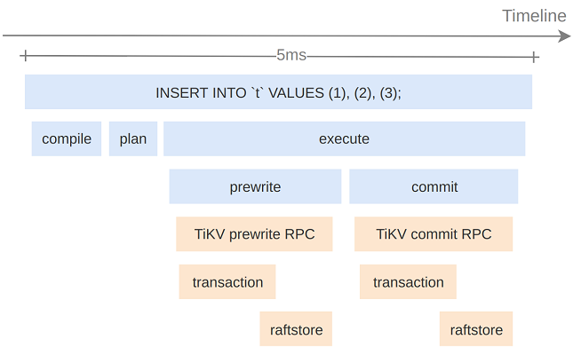

从图中可以直观看到 SQL 语句 “INSERT INTO `t` VALUES (1), (2), (3);”  有趣的信息：

- TiDB 处理这个请求时依次进行了 compile、plan、execute 三个步骤

- TiDB 在 execute 阶段调用了 TiKV 的 Prewrite RPC 和 Commit RPC

- 请求共耗时 5ms

图中每个方框代表一个事件，称之为 Span。每个 Span 包含：

- 事件名称

- 事件起始时间戳和结束时间戳

Span 之间有层级，可以构成父子关系或先后关系，如下图所示：

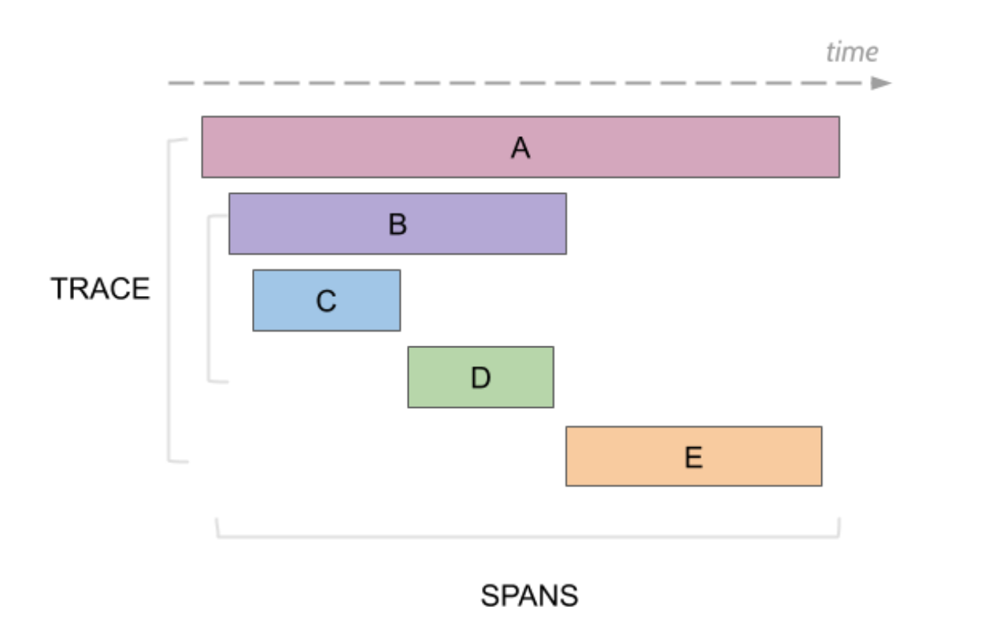

## 实现

>本文所有性能测试结果，若特别说明测试环境，均在以下平台完成：

>- CPU: Intel Core i7-8700

>- Linux distros: Ubuntu 20.04

>- Linux kernel: 5.4

>- Memory: 32G

>- Disk: NVMe SSD

TiKV 使用 Rust 编写。Rust 生态中有几个现成的追踪库，分别是 [tokio-tracing](https://github.com/tokio-rs/tracing), [rustracing](https://github.com/sile/rustracing) 和 [open-telemetry](https://github.com/open-telemetry/opentelemetry-rust)，它们都兼容 OpenTracing 规范，但**性能不够理想**，引入后会降低 TiKV 50% 以上性能。**TiKV 目前的实现能将性能的影响控制在 5% 以内**。这主要来自于单个 **Span 追踪收集仅耗时 20ns**：

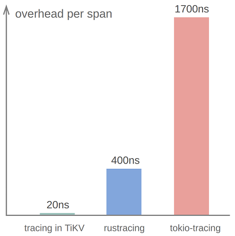

以下具体介绍 TiKV 如何在 20ns 内完成单个 Span 追踪和收集。

### 计时

计时在追踪中是高频操作，每个 Span 都需要取两次时间戳，分别代表事件的起始和结束时刻，因此**计时的性能会很大程度上影响追踪的性能**。

追踪库采用的计时方式通常需要能满足以下要求：

- 获取的时间戳单调递增

- 高性能

- 高精度

### std::Instant

Rust 原生提供以下两种计时方式：

- `std::SystemTime::now()`

- `std::Instant::now()`

其中第一种方式获取的是当前系统时间，它可能受用户手动调整、NTP 服务修正等原因的影响，获取到的时间戳并不提供单调递增的保证，因此不能采用。

大多数 Rust 社区的追踪库采取了第二种方式，可以取得单调递增的、纳秒精度的时间戳。但它的性能不够理想，取两次时间需要 50ns，这是社区追踪库性能较低的原因之一。

### Coarse Time

若仅从高性能的角度出发来寻找计时方案，可使用 Coarse Time，它**牺牲了一定的精度换取高性能**。在 Linux 环境下，以 `CLOCK_MONOTONIC_COARSE` 作为时间源参数，通过 `clock_gettime` 系统调用可获取 Coarse Time。Rust 社区也提供了库 [coarsetime](https://docs.rs/coarsetime/0.1.18/coarsetime/) 获取 Coarse Time：

`coarsetime::Instant::now()`

Coarse Time 性能很高，在测试环境下完成两次调用仅需要 10ns。它的精度取决于 Linux 的 jiffies 配置，默认精度为 4ms。

低精度的计时对于短耗时请求的追踪会产生让人困惑的结果。如下图所示，从观测的角度来看已经损失了相当一部分的细节信息：

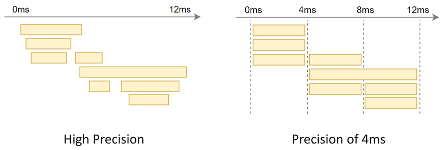

当然**在多数情况下，Coarse Time 仍是快速计时的首选**。一方面是它在 Linux 系统下开箱即用，获取方便。另一方面，4ms 精度对大部分应用来说是可以接受的。

尽管如此，作为追踪功能的开发者，我们不希望限制用户的场景，例如对于 KvGet 请求，4ms 在要求高的场景中已足够作为异常的抖动需要追溯了，因此**有必要支持微秒乃至纳秒级别精度的追踪**。同时，性能作为核心出发点，也不能被牺牲掉。幸运的是，这个问题是有解的，它便是接下来要介绍的 TSC。

### TSC

TiKV 采用 Time Stamp Counter (TSC) 寄存器进行高精度高性能计时。TSC 寄存器在现代 x86 架构的 CPU 中已经存在很久了，最早可以追溯到 2003 年推出的奔腾处理器。它记录了 CPU 供电重设后到当前时刻所经过的 CPU 时钟周期数。在 CPU 时钟周期速率相同的条件下，经过测量和换算即可用于高精度计时。

**TSC 可以同时满足单调递增、高精度和高性能的需求。**在我们的测试环境中取两次 TSC 仅需 15ns。在实际情况中，随着处理器的不断发展，TSC 寄存器积累了相当多历史遗留问题会对其正确性造成影响，需要修正。

#### TSC 速率

TSC 递增速率由 CPU 频率决定。**现代化 CPU 可能会动态调节频率节省能耗，导致 TSC 递增速率不稳定：**

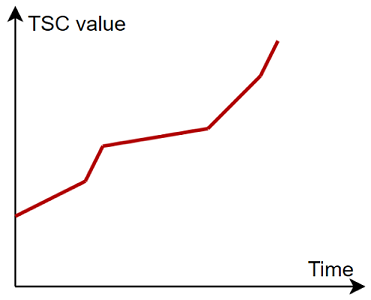

另外，**一些 CPU 在休眠状态时不会递增 TSC**：

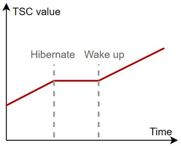

比较现代的 x86 架构 CPU 提供了特性确保 TSC 递增速率的稳定性。在 Linux 下可以通过 `/proc/cpuinfo` 中的 CPU flag 来检查 TSC 速率是否稳定：

- constant_tsc: TSC 将以固定的额定标称频率而非瞬时频率递增

- nonstop_tsc: TSC 在 CPU 休眠状态下仍持续递增

以上 TSC 速率的稳定性保证仅对单个 CPU 核心有效，在多核情况下还需处理 TSC 同步问题。

#### TSC 多核同步

x86 架构 CPU **没有提供 TSC 寄存器在所有核心上的一致性保证**，这会导致计时存在问题。下图展示了某台 2020 年生产的搭载了当时最新 x64 CPU 的笔记本上 TSC 测量情况。可以看到，16 个核心中有一个核心 CPU 0 的 TSC 值存在偏差。

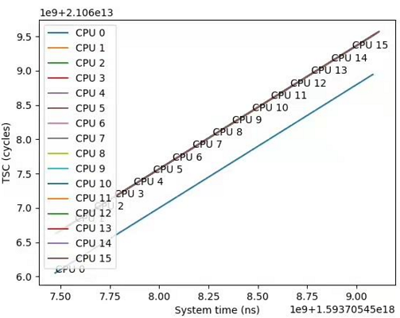

在追踪中，完整的计时操作会读取两次时间戳，分别代表事件的始末。由于操作系统的线程调度，这两个时间戳的读取可能发生在不同的核心上。若我们简单地以 TSC 值差值进行计时，会**在多核 TSC 不同步的情况下造成耗时计算的偏差**。

举个例子：

1. t1 时刻，线程在 Core 1 上运行，读取了较大的 tsc1

2. 操作系统将线程从 Core 1 调度至 Core 2

3. t2 时刻，线程在 Core 2 上运行，读取了较小的 tsc2

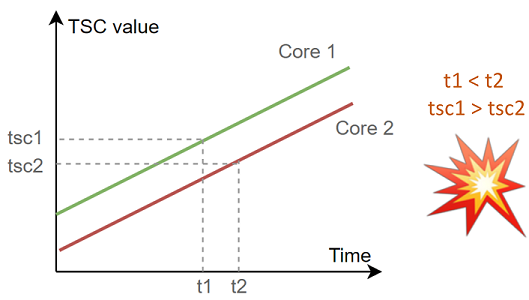

此时计算的 TSC 差值甚至成为了负数，无法换算为耗时。

为了解决这个问题，**TiKV 会同步各个核心的原始 TSC 值，计算出 TSC 值在各个核心的偏移量**，使用同步过后的 TSC 值用于计算耗时。具体算法为在各个核心上任取两次 TSC 和物理时间，以物理时间作为 x 轴、核心上的 TSC 作为 y 轴计算截距，差值即为各个核心的 TSC 偏移，如下图所示：

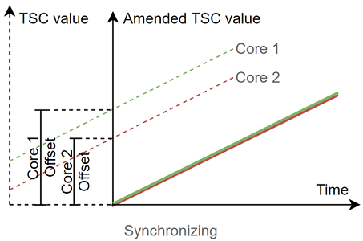

在计算初始 TSC 偏移时，**需要确保取两次 TSC 的过程全都同一核心上执行**。在 Linux 中可以通过系统调用 `sched_setaffinity` 设置线程的亲核性，将线程固定到某个核心上运行：

```
fn set_affinity(cpuid: usize) -> Result<(), Error> {
   use libc::{cpu_set_t, sched_setaffinity, CPU_SET};
   use std::mem::{size_of, zeroed};
 
   let mut set = unsafe { zeroed::<cpu_set_t>() };
   unsafe { CPU_SET(cpuid, &mut set) };
 
   // Set the current thread's core affinity.
   if unsafe {
       sched_setaffinity(
           0, // Defaults to current thread
           size_of::<cpu_set_t>(),
           &set as *const _,
       )
   } != 0
   {
       Err(std::io::Error::last_os_error().into())
   } else {
       Ok(())
   }
}
```

有了各个核心的 TSC 偏移值后，在计时阶段只需获取当前执行线程所在的 CPU 及 TSC 值，即可计算出同步后的 TSC 值。需要注意的是，当前执行所在的 CPU 及当前的 TSC 值需要在一条指令中同时获取，避免其中插入操作系统的线程调度导致计算错误。这可以**通过 RDTSCP 指令实现**。它可以帮助我们原子性地获取原始 TSC 值和 CPU ID。Rust 代码如下：

```
#[cfg(any(target_arch = "x86", target_arch = "x86_64"))]
fn tsc_with_cpuid() -> (u64, usize) {
   #[cfg(target_arch = "x86")]
   use core::arch::x86::__rdtscp;
   #[cfg(target_arch = "x86_64")]
   use core::arch::x86_64::__rdtscp;
 
   let mut aux = std::mem::MaybeUninit::<u32>::uninit();
   let tsc = unsafe { __rdtscp(aux.as_mut_ptr()) };
   let aux = unsafe { aux.assume_init() };
 
   // IA32_TSC_AUX are encoded by Linux kernel as follow format:
   //
   // 31       12 11      0
   // [ node id ][ cpu id ]
   (tsc, (aux & 0xfff) as usize)
}
```

上文描述的高精度计时的逻辑已经提取成一个独立的 Rust 社区库 [minstant](https://github.com/zhongzc/minstant.git)，可供相似需求的其他项目直接使用。

### Span 收集

Span 可能在各个线程上产生，最终要收集起来汇聚成一个追踪，因此需要跨线程的 Span 收集机制。**Span 的收集也是追踪库的一个常见性能瓶颈点**。

一般有以下方式进行线程安全的 Span 收集：

- `Arc<Mutex<Vec<Span>>>`

- `std::sync::mpsc::Receiver<Span>`

- `crossbeam::channel::Receiver<Span>`

这几种常见的收集方式中 crossbeam channel 是最优的，发送和收集一次 Span 的耗时约为 40ns。为了在提升性能，TiKV 采用了与上述不同的方式收集 Span：同一线程上 Span 仅**在线程本地无竞争地收集**、最终汇集各个线程上已经**收集好的一批 Span 到全局收集器**。

#### Local Span

TiKV 为每个线程维护一个线程本地结构 LocalSpanLine，负责 LocalSpan 的产生和存储。再由另外一个线程本地结构 LocalCollector，负责驱动 LocalSpanLine 和收集 LocalSpan。这三者之间的关系和各自的职责如下图。

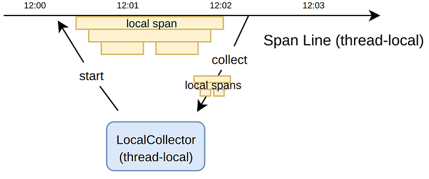

由于 LocalSpan、LocalSpanLine 和 LocalCollector 均是线程本地的，它们之间的交互均**不需要线程间的同步和互斥，也不会破坏内存缓存**，因此性能极高。LocalSpan 的收集是简单的 `Vec::push` 操作，平均耗费仅为 4ns。

另外，在构造 Span 依赖关系时，利用线程本地的特性可以很方便地实现**隐式上下文**的机制，**用户无需修改函数签名来手动传递追踪上下文**，大大降低了对现有代码的侵入性。

下面我们来深入了解关于 LocalSpan 产生和收集的实现细节。

首先，LocalSpanLine 维护了一个容器 SpanQueue，用于装载正在进行的或者已经完成的 LocalSpan。“正在进行”意味着 LocalSpan 所指示的事件开始时间已知，而结束时间未知。这些 LocalSpan 均存储在 SpanQueue 内部的 Vec 结构。

除此之外，上文提到我们利用隐式上下文来构造 LocalSpan 之间的父子依赖关系，这个过程实际上依赖于 SpanQueue 维护的一个变量 `next_parent_id`。

接下来我们将通过一些例子对整个过程进行更为详细的展开。

假设这样一个 foo 事件，于 09:00 产生，持续至 09:03：

```
09:00  foo +
09:01      |
09:02      |
09:03      +
```

初始状态下，SpanQueue 为空，`next_parent_id` 记为 root。那么在 foo 发生的时刻，即 09:00，SpanQueue 会去完成以下几个步骤：

- 新增一条记录，填写事件名称 foo，起始时间 09:00，留空结束时间

- 将 `next_parent_id` 的值赋给 foo 的 parent

- 将 `next_parent_id` 更新为 foo

- 向外部返回 `index` 的值 0，用以接收事件结束的通知，进而完成后续结束时间的回填


在 foo 结束的时刻，即 09:03，用户提交 `index`，向 SpanQueue 通知 foo 事件结束，于是 SpanQueue 开始回填工作：

- 通过 `index` 索引到 foo 事件所在记录

- 将结束时间回填为 09:03

- 将 `next_parent_id` 更新为该记录的 `parent`


以上的例子描述了单个事件的记录过程，很简单也很有效。而实际上多个事件的记录也仅仅只是上述过程的重复。比如下面的过程，foo 事件包含了两个子事件：bar 和 baz。

```
09:00  foo +
09:01      | bar +
09:02      |     |
09:03      |     +
09:04      |
09:05      | baz +
09:06      |     |
09:07      |     +
09:08      +
```

正如上文所述，SpanQueue 除了记录各个事件的起始和结束时间，还需要记录各个事件之间的父子依赖关系。这个例子中，foo 发生时 SpanQueue 的存储内容和上文没有区别。而在 bar 发生时，SpanQueue 设置 bar 的 parent 为当前的 `next_parent_id` 值，即 foo，同时将 `next_parent_id` 更新为 bar：


在 bar 结束时，会按照上面提到的回填步骤，更新 bar 记录的结束时间以及 `next_parent_id` 变量：


重复以上步骤，最终 SpanQueue 以一种高效的方式，完整记录了这三个事件的信息：


将这些记录串连起来，最终形成如下的 Trace 树状结构：

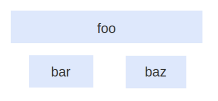

#### Normal Span

虽然 LocalSpan 的记录比较高效，但是由于其本身基于线程本地的实现方式，使得灵活性不足。比如在异步场景下，一些 Span 的产生和结束发生在不同的线程，线程本地的实现就不再能发挥作用。

针对上述问题，TiKV 保留了前文最开始所描述的线程安全的 Span 记录方式，即采用 crossbeam channel 每次进行单个 Span 的收集，这样的 Span 下文称之为 NormalSpan。

从实现的角度看，NormalSpan 的信息不会记录在线程本地的容器当中，而是由相应的变量自行维护，以便于跨线程的移动。同时，NormalSpan 之间的父子关系不再由线程本地隐式构建，而需由用户手动指定。

但是，NormalSpan 和 LocalSpan 并非完全隔离，TiKV 通过以下的交互方式将这两者联系起来：从 LocalCollector 收集而来的一组 LocalSpan，可以挂载在 NormalSpan 上作为子树，如下图所示。同时，挂载的数量不受限制，通过允许进行多对多的挂载方式，TiKV 在一定程度上支持了对 batch 场景的追踪，这是社区中大部分追踪库没有覆盖到的。

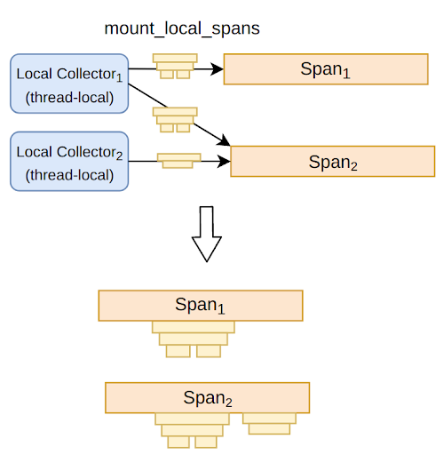

上述实现方式形成了 Span 收集的快慢两条路径。它们共同合作，完成对某个请求的执行路径信息的记录：

- LocalSpan 不可跨越线程但记录高效，通过批量收集 LocalSpan 然后挂载至普通 Span 的方式，让追踪的开销变得非常低。

- 普通 Span 的记录相对较慢，不过它可以跨线程传递，使用起来比较灵活。

## 使用方法

**TiKV 中的高性能追踪的逻辑已提取成一个独立的库** [minitrace-rust](https://github.com/tikv/minitrace-rust)，可直接在各种项目中使用，步骤如下：

1. 请求到达时，创建对应根 Span；

2. 请求执行路径上，使用 minitrace-rust 提供的接口记录事件的发生；

3. 请求完成时，收集执行路径上产生的所有 Span。

### 根 Span 的创建和收集

一般在一个请求开始的时候可以创建根 Span。在 minitrace-rust 中用法如下：

```
for req in listener.incoming() {
   let (root_span, collector) = Span::root("http request");
   let guard = root_span.enter();
   my_request_handler(req);
}
```

Span 基于 Guard 实现了自动在作用域结束后结束 Span，而无需手工标记 Span 的终止。除了返回根 Span 外，`Span::root(event)`  还返回了一个 `Collector`。 `Collector` 与根 Span 一一对应。在请求完成时，可调用 `Collector` 的 `collect` 方法，从而完成对执行路径上产生的所有 Span 的收集。如下所示。

```
let (root_span, collector) = Span::root("http request");
let guard = root_span.enter();
 
handle_http_request(req);
 
drop((guard, root_span));
let spans = collector.collect();
```

### 事件记录

比较推荐使用 minitrace-rust 提供的 `trace` 和 `trace_async` 宏进行函数级别的事件记录。通过上述方式为单个函数记录的执行信息如下：

1. 调用的发生时刻

2. 调用的返回时刻

3. 直接（或间接）调用者的引用

4. 直接（或间接）调用的子函数的引用

例如，追踪两个同步函数 `foo` 和 `bar`，通过添加 `trace(event)` 作为这两个函数的 attribute，即可记录函数的执行信息。如下所示。

```
#[trace("foo")]
fn foo() -> u32 {
   bar();
   42
}
 
#[trace("bar")]
fn bar() { }
```

最终记录下来的信息，包括这两个函数各自的起始和完成时刻，以及函数调用关系：`foo` 调用了 `bar`。

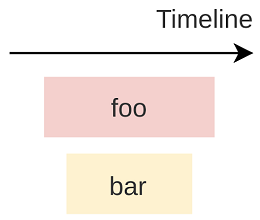

对于异步函数的记录，步骤略有不同。首先须将 `trace` 替换成 `trace_async`，如下所示。

```
#[trace_async("foo async")]
async fn foo_aysnc() -> u32 {
   bar_async().await;
   42
}
 
#[trace_async("bar async")]
async fn bar_async() {
   yield_now().await;
}
```

另外还需要关键的一步：将 Task 用 minitrace-rust 提供的 Future 适配器 `in_span` 进行包装，从而将该 Future 与某个 Span 绑定起来。

Task，在 Rust 异步语境中，特指被 spawn 至某个 executor 的 Future，也称根 Future。例如以下的 `foo_async` 就是一个 Task：

```
executor::spawn(
   foo_async()
);
```

假设要追踪 `foo_async` 这样一个 Task，并且与一个由 `Span::from_local_parent(event)` 创建的 Span 进行绑定，那么，相关的应用代码将如下所示。

```
executor::spawn(
   foo_async().in_span(Span::from_local_parent("Task: foo_async"))
);
```

下图为该 Task 追踪的结果：

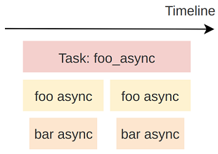

## 结语

TiKV 作为底层 KV 数据库，对其增加观测性功能天然有着与普通业务程序完全不一样的性能要求，非常具有挑战性。除了追踪以外，TiKV 及其上层 SQL 数据库 TiDB 也还有其他富有挑战性的观测性需求。PingCAP 的 Observability 团队专注于这类观测难题的解决与功能实现，感兴趣的同学可投递简历到 [hire@pingcap.com](hire@pingcap.com) 加入我们，或加入 Slack channel [#sig-diagnosis](https://slack.tidb.io/invite?team=tidb-community&channel=sig-diagnosis&ref=tracing) 参与技术讨论。


