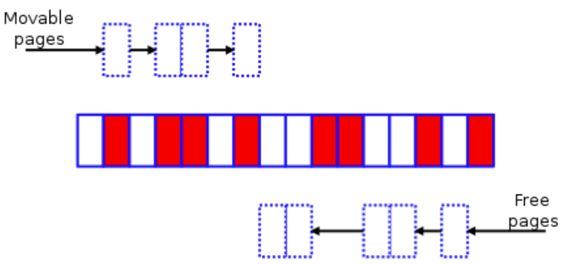
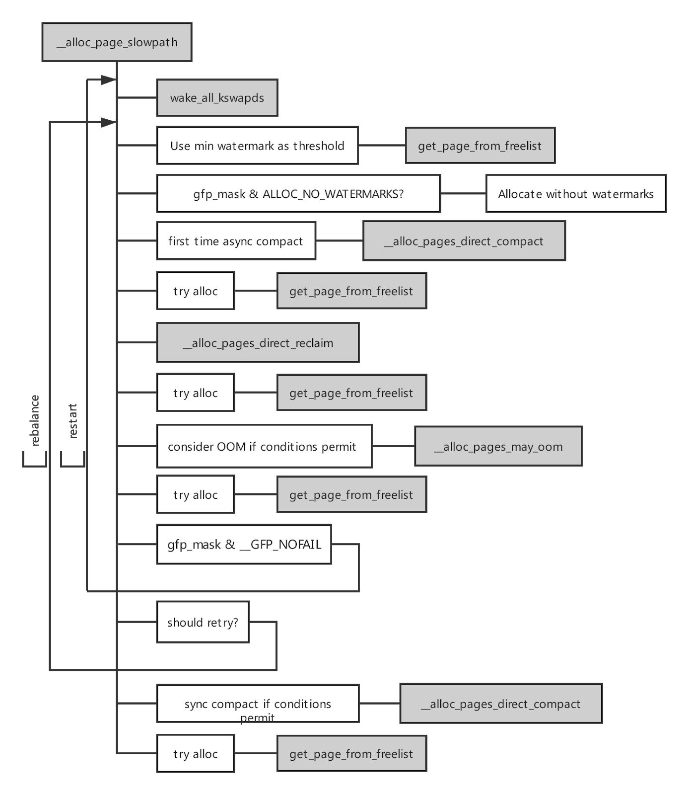

从 [Linux 内核 VS 内存碎片 （上）](https://pingcap.com/blog-cn/linux-kernel-vs-memory-fragmentation-1/) 我们可以看到根据迁移类型进行分组只是延缓了内存碎片，而并不是从根本解决，所以随着时间的推移，当内存碎片过多，无法满足连续物理内存需求时，将会引起性能问题。因此仅仅依靠此功能还不够，所以内核又引入了内存规整等功能。

## 内存规整

在内存规整引入之前，内核还使用过 lumpy reclaim 来进行反碎片化，但在我们当前最常用的 3.10 版本内核上已经不存在了，所以不做介绍，感兴趣的朋友请从文章开头整理的列表中自取，我们来看内存规整。

内存规整的算法思想在 [Memory compaction](https://lwn.net/Articles/368869/) 有详细描述，简单来说是从选中的 zone 底部扫描已分配的迁移类型为 MIGRATE_MOVABLE 的页面，再从此 zone 的顶部扫描空闲页面，把底部的可移动页移到顶部的空闲页，在底部形成连续的空闲页。

选中的碎片化 zone：

扫描可移动的页面：

扫描空闲的页面：

规整完成：

看上去原理比较简单，内核还提供了手动规整的接口：/proc/sys/vm/compact_memory，但实际上如前言所说（至少对我们最常用的 3.10 版本内核）无论是手动还是自动触发，内存规整并不好用，其开销过大，反而成为性能瓶颈：[Memory compaction issues](https://lwn.net/Articles/591998/)。不过社区并没有放弃这一功能，而是选择不断完善，比如在 v 4.6 版本引入 [mm, compaction: introduce kcompactd](https://github.com/torvalds/linux/commit/698b1b3064)，v4.8 版本引入  [make direct compaction more deterministic](https://lwn.net/Articles/686801/) 等。

对于 3.10 版本内核，内存规整的时机如下：

在分配高阶内存失败后 kswapd 线程平衡 zone；

直接内存回收来满足高阶内存需求，包括 THP 缺页异常处理路径；

khugepaged 内核线程尝试 collapse 一个大页；

通过 /proc 接口手动触发内存规整；

其中和 THP 有关的路径，我在上一篇文章  [我们为什么要禁用 THP](https://pingcap.com/blog-cn/why-should-we-disable-thp/) 有提到其危害并建议大家关闭了，所以在这里不对 THP 路径做分析，主要关注内存分配路径：

基本流程：当申请分配页的时候，如果无法从伙伴系统的 freelist 中获得页面，则进入慢速内存分配路径，率先使用低水位线尝试分配，若失败，则说明内存稍有不足，页分配器会唤醒 kswapd 线程异步回收页，然后再尝试使用最低水位线分配页。如果分配失败，说明剩余内存严重不足，会先执行异步的内存规整，若异步规整后仍无法分配页面，则执行直接内存回收，或回收的页面数量仍不满足需求，则进行直接内存规整，若直接内存回收一个页面都未收到，则调用 oom killer 回收内存。

上述流程只是简化后的描述，实际工作流程会复杂的多，根据不同的申请的阶数和分配标志位，上述流程会有些许变化，为避免大家陷入细节，我们在本文不做展开。为方便大家定量分析直接内存回收和内存规整为每个参与的线程带来的延迟，我在 [BCC](https://github.com/iovisor/bcc) 项目中提交了两个工具：[drsnoop](https://github.com/iovisor/bcc/blob/master/tools/drsnoop_example.txt) 和 [compactsnoop](https://github.com/iovisor/bcc/blob/master/tools/compactsnoop_example.txt)，这两个工具的文档写得很详细了，但在分析时需要注意一点，为了降低 BPF 引入的开销，这里抓取的每一次对应事件的延迟，因此和申请内存的事件相比，可能存在多对一的关系，对于 3.10 这样的老内核，在一次慢速内存分配过程中会重试多少次是不确定的， 导致 oom killer 要么太早的出场，那么太晚，导致服务器上绝大部分任务长期处于 hung up 状态。 内核在 4.12 版本合入 [mm: fix 100% CPU kswapd busyloop on unreclaimable nodes](https://github.com/torvalds/linux/commit/c73322d0) 限定了直接内存回收的最大次数。我们按这个最大次数 16 来看，假设平均一次直接内存回收的延迟是 10ms （对于现在百G内存的服务器来说，shrink active/inactive lru 链表是很耗时的，如果需要等待回写脏页还会有额外的延迟）。所以当某个线程在通过页面分配器申请页面时，只执行一次直接内存回收就回收了足够的内存，那么这次分配内存的增加延迟就增加了 10ms，若重试了 16 次才回收到足够的页面，则增加的延迟就不再是 10ms 而是 160 ms 了。

我们回过来看内存规整，内存规整核心逻辑主要分为 4 步：

1. 判断内存 zone 是否适合进行内存规整；

2. 设置扫描的起始页帧号；

3. 隔离  MIGRATE_MOVABLE 属性页面；

4. 迁移 MIGRATE_MOVABLE 属性页面到 zone 顶部；

执行一次迁移后，若还需要继续规整，则循环执行 3 4 直到规整完成。因此会消耗大量的 CPU 资源，从监控上经常看到 sys cpu 被打满。

页面迁移也是一个大话题，除了内存规整外，还有其他场景也会使用内存迁移，因此我们不在此展开。我们看下如何判断 zone 是否适合进行内存规整：

1. 对于通过 /proc 接口强制要求规整的情况来说，没啥说的，服从命令听指挥；

2. 利用申请的阶数判断 zone 是否有足够剩余内存可供规整 （不同版本内核算法细节上有差异），计算碎片指数，当指数趋近 0 则表示内存分配将因内存不足而失败，所以此时不宜做内存规整而是做内存回收。当指数趋近 1000 时则表示内存分配将因外部碎片过多导致失败，所以不适合做内存回收而是做内存规整，在这里规整和回收的分界线由外部碎片阈值决定：/proc/sys/vm/extfrag_threshold;

内核开发者也为我们提供观察内存指数的接口： 

通过执行 cat /sys/kernel/debug/extfrag/extfrag_index 可以观测到 （这里存在小数点是因为除了 1000）。

## 结语

本文简述了为什么外部内存碎片会引起性能问题，以及社区多年来在反碎片化方面做的努力，重点介绍了 3.10 版本内核反碎片的原理和定量、定性观察方法。期待对大家有所帮助。

在描述内存规整的时候捎带提到了直接内存回收的原因是，直接内存回收不仅会出现在内存严重不足的情况，在真正的场景中也会内存碎片原因导致触发内存直接回收，二者在一段时间内可能是混合出现的。

本文同时也介绍了基于 /proc 文件系统的监控接口和基于内核事件的工具，二者相辅相成，基于 /proc 的监控接口用起来简单，但存在无法定量分析和采样周期过大等问题，基于内核事件的工具可以解决这些问题，但需要对内核相关子系统的工作原理要有一定理解，对客户的内核版本也有一定要求。

对于如何减少直接内存回收出现的频率以及出现碎片问题后如何缓解，我的想法是对于需要大量操作 IO 的 workload 场景，由于内核在设计上照顾慢速后端设备，比如在 lru 算法的基础上实现二次机会法、Refault Distance 等，且没有提供限制 page cache 占比的能力 （一些公司为自己的内核定制了此功能并尝试过提交给上游内核社区，但上游社区一直没有接受，个人觉得可能存在导致 workingset refault 等问题）。所以对于超过百 G 大内存机器的场景，提高 vm.min_free_kbytes 变相限制 page cache 占比是个比较好的选择 （最高不要超过总内存的 5%）。虽然调大 vm.min_free_kbytes 确实会导致一些内存浪费，不过对于 256G 内存的服务器来说，我们设置成 4G，也只占了 1.5%。社区显然也注意到了这点，在 4.6 版本的内核合并了 [mm: scale kswapd watermarks in proportion to memory](http://lkml.iu.edu/hypermail/linux/kernel/1602.3/02009.html) 对此进行了优化。另外一个方法是在适当的时机执行 drop cache，但可能会给业务带来较大的抖动。

期待大家的交流与反馈！

