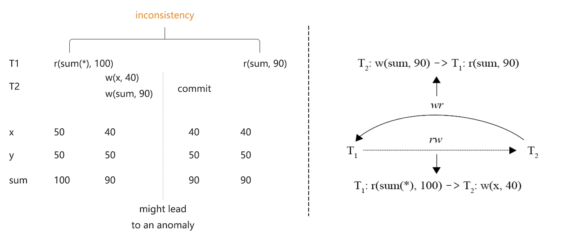
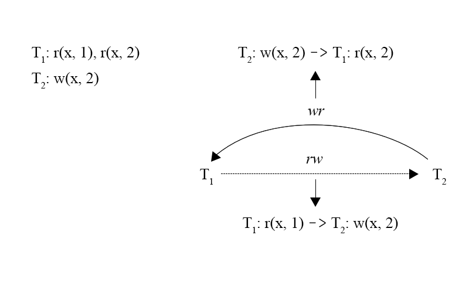
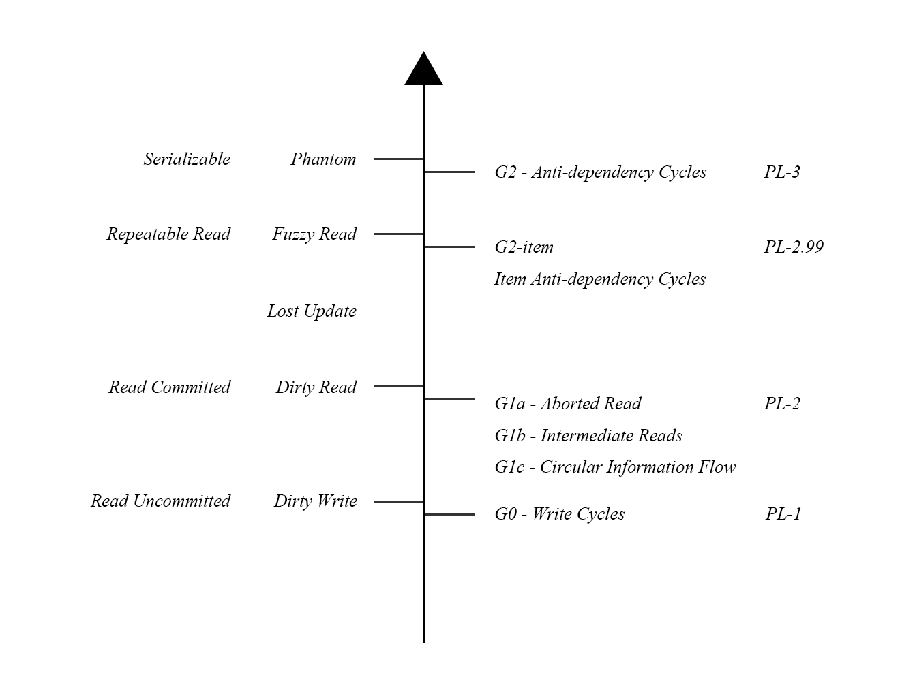
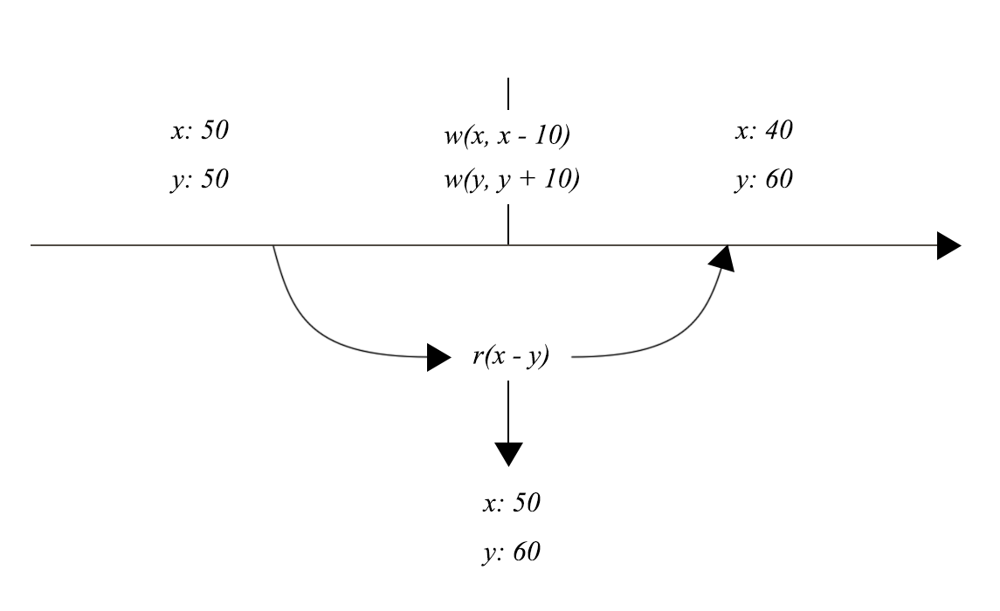

## 绪论
在上篇，我们分析了 ANSI SQL-92 和「A Critique of ANSI SQL Isolation Levels」对隔离级别做出的定义，并且指出了在现今的认知中，其中的一些缺陷。本篇将继续讨论隔离级别的问题，讲述实现无关的隔离级别定义和 TiDB 的表现和隔离级别。

## Generalized Isolation Level Definitions

### 介绍

上文所讲的「A Critique of ANSI SQL Isolation Levels」这篇文章在定义隔离级别的时候，对事务的过程也提出了诸多的要求，然而「Generalized Isolation Level Definitions」仅对成功提交的事务做了约束，即所有异常现象都是由成功提交的事务产生的。在例 1-a 中，因为 T1 没有成功提交，所以并没有出现异常，而例 1-b 中 T1 读到了 abort 事务 T2 的写入内容并且提交成功了，产生了异常现象（G1a - Aborted Read）。

|Txn1|Txn2|
|-|-|
|| `w(x, 1)` |
| `r(x, 1)` ||
| `abort` ||
|| `abort` |

<div class="caption-center">例 1-a - 提交是出现异常的必要条件</div>

|Txn1|Txn2|
|-|-|
|| `w(x, 1)` |
| `r(x, 1)` ||
|| `abort` |
| `commit` ||

<div class="caption-center">例 1-b - 提交是出现异常的必要条件</div>

「Generalized Isolation Level Definitions」提出了与实现无关的隔离级别定义，并且更清晰的解释了 predicate 和 item 现象所带来的异常区别，提出了对标 ANSI SQL-92 的隔离级别。

### 依赖图
Adya 首先引入了三类依赖，可以简单的概括为写读(WR)，读写(RW)和写写(WW)。含有读的依赖按照读操作的 item 和 predicate 查询类别被细分为两种类型，item 指的是在一个 key 之上产生的依赖；而 predicate 则是指改变了一个 predicate 结果集，包括改变其中某个 item 的值和改变某个 item 在 predicate 下的命中状态。

两个事务间存在依赖则一定程度上代表了两个事务在现实时间中的先后关系，如果两个依赖中分别出现了 T1 先于 T2 和 T2 先于 T1 的现象，那么就证明出现了事务在现实事件中交叉出现的现象，破坏了 Serializable，这是本篇论文的核心观点。

#### Read Dependencies (WR)

WR 依赖指的是为 T2 读到了 T1 写入的值。

例 2 是针对单个 key 的 WR 依赖，T2 读到了 T1 写入的值，称为 Directly item-read-depends。


|Txn1|Txn2|
|-|-|
| `w(x, 1)` ||
|| `r(x, 1)` |
|| `commit` |
| `commit` ||

<div class="caption-center">例 2 - Directly item-read-depends</div>

例 3 是 predicate 条件下的 WR 依赖，例 3-a 是将一个 key 从符合 predicate 条件改为了不符合条件，而例 3-b 是将一个 key 从不符合 predicate 条件改为了符合条件。

|Txn1|Txn2|
|-|-|
| `r(x, 1)` ||
| `w(x, 10)` ||
|| `r(sum(x)\|x<10)` |
|| `commit` |
| `commit` ||

<div class="caption-center">例 3-a - Directly predicate-read-depends</div>

|Txn1|Txn2|
|-|-|
| `r(x, 10)` ||
| `w(x, 1)` ||
|| `r(sum(x)\|x<10)` |
|| `commit` |
| `commit` ||

<div class="caption-center">例 3-b - Directly predicate-read-depends</div>

#### Anti-Dependencies(RW)

WR 依赖指的是为 T2 修改了 T1 读到的值。

例 4 是针对单个 key 的 RW 依赖，T1 在 T2 读到的 key 之上写入了新值，称为 Directly item-anti-depends。

|Txn1|Txn2|
|-|-|
|| `r(x, 1)` |
| `w(x, 2)` ||
|| `commit` |
| `commit` ||

<div class="caption-center">例 4 - Directly item-anti-depends</div>

例 5 是 predicate 条件下的 WR 依赖，例 5-a 是将一个 key 从符合 predicate 条件改为了不符合条件，而例 5-b 是将一个 key 从不符合 predicate 条件改为了符合条件。

|Txn1|Txn2|
|-|-|
| `r(x, 1)` ||
|| `r(sum(x)\|x<10)` |
| `w(x, 10)` ||
|| `commit` |
| `commit` ||

<div class="caption-center">例 5-a - Directly predicate-anti-depends</div>

|Txn1|Txn2|
|-|-|
| `r(x, 10)` ||
|| `r(sum(x)\|x<10)` |
| `w(x, 1)` ||
|| `commit` |
| `commit` ||

<div class="caption-center">例 5-b - Directly predicate-anti-depends</div>

#### Write Dependencies(WW)

WW 依赖指的是两个事务写了同一个 key，例 6 中 T1 写入了 x 的第一个值，T2 写入了 x 的第二个值。

|Txn1|Txn2|
|-|-|
| `w(x, 1)` ||
|| `w(x, 2)` |
| `commit` ||
|| `commit` |

<div class="caption-center">例 6 - Directly Write-Depends</div>

#### DSG

DSG (Direct Serialization Graph) 可以被称为有向序列化图，是将对一系列事务进行以来分析后，将上述的三种依赖作为 edge，将事务作为 node 绘制出来的图。图 1 展示了从事务历史分析得到 DSG。如果 DSG 是一个有向无环图（如图 1 所示），那么这些事务间的依赖关系所决定的事务先后关系不会出现矛盾，反之则代表可能有异常，这篇文章根据出现异常时组成环的 edge 的依赖类型，定义了隔离级别。


<div class="caption-center">图 1 - 从事务历史分析 DSG</div>

### 异常现象与隔离级别

为了不和「A Critique of ANSI SQL Isolation Levels」产生符号上的冲突，这篇文章使用 G 表示异常现象，使用 PL 表示隔离级别。

#### PL-1 & G0

G0 (Write Cycles) 和类似于脏写定义，但要求 P0 (Dirty Write) 现象实际产生异常，如果仅仅是两个事务写同一个 key 并且并行了，他们还是可以被视为 Serializable，只有当两个事务互相出现依赖的时候才属于 G0 现象。例 7-a属于 P0 现象，但只看这个现象本身，是符合 Serializable 的，而例 7-b 同时发生了 P0 和 G0。

|Txn1|Txn2|
|-|-|
| `w(x, 1)` ||
|| `w(x, 2)` |
| `commit` | `commit` |

<div class="caption-center">例 7-a - P0 (Dirty Write) 与 G0 对比 - P0</div>

|Txn1|Txn2|
|-|-|
| `w(x, 1)` ||
|| `w(x, 2)` |
|| `w(y, 1)` |
| `w(y, 2)` ||
| `commit` | `commit` |

<div class="caption-center">例 7-b - P0 (Dirty Write) 与 G0 对比 - G0</div>

如果不会出现 G0 现象，则达到了 PL-1 的隔离级别。

#### PL-2 & G1

G1 现象有三条，其中 G1a 和 G1b 与依赖图无关，G1c 是依赖图上的异常。

G1a (Aborted  Reads) 指读到了中断事务的内容，例 8 是 G1a 现象的两种情况，不管是通过 item 类型还是 predicate 类型的查询读到了中断事务的内容，都属于 G1a 现象。例 8-a 中，T1 将 x 写为 2，但是这个事务最后产生了 abort，而 T2 读到了 T1 写入的结果，产生了 G1a 现象；在例 8-b 中 T1 将 x 从 1 改写为 2，此时 sum 的值也会因此从 10 变为 11，但是因为 T1 最后产生了 abort，所以 T2 读取到 sum 为 11 的值也属于 G1a 现象。

|Txn1|Txn2|
|-|-|
| `r(x, 1)` ||
| `w(x, 2)` ||
|| `r(x, 2)` ||
| `abort` | `commit` |

<div class="caption-center">例 8-a - G1a 现象</div>


|Txn1|Txn2|
|-|-|
| `r(x, 1)` ||
| `r(sum, 10)` ||
| `w(x, 2)` ||
|| `r(sum, 11)` |
| `abort` | `commit` |

<div class="caption-center">例 8-b - G1a 现象</div>

G1b (Intermediate Reads) 指读到了事务的中间内容，例 9 是 G1b 的两种情况，item 类型和 predicate 类型的读取都属于 G1b 现象。在例 9-a 中，T1 将 x 从 1 修改为 2，最后修改为 3，但是对于其他事务而言，只能观察到 T1 最后修改的值 3，所以 T2 读取到 x=2 的行为属于 G1b 现象；在例 9-b 中，T2 虽然没有直接从 T1 读取到 x=2 的值，但是其读取到的 sum=11 也包括了 x=2 的结果，其结果而言仍然读取到了事务的中间状态，属于 G1b 现象。

|Txn1|Txn2|
|-|-|
| `r(x, 1)` ||
| `w(x, 2)` ||
| `w(x, 3)` ||
|| `r(x, 2)` |
| `commit` | `commit` |

<div class="caption-center">例 9-a - G1b 现象</div>

|Txn1|Txn2|
|-|-|
| `r(x, 1)` ||
| `r(sum, 10)` ||
| `w(x, 2)` ||
| `w(x, 3)` ||
|| `r(sum, 11)` |
| `commit` | `commit` |

<div class="caption-center">例 9-b - G1b 现象</div>

G1c (Circular Information Flow) 指 WW 依赖和 WR 依赖组成的 DSG 中存在环，图 2 描述了 G1c 现象，这个例子可以理解为，T1 和 T2 同时写了 x，并且 T2 是后写的，所以 T2 应该晚于 T1 提交，同理 T3 应该晚于 T2 提交。而最后 T1 读到了 T3 写入的 z = 4，所以 T3 需要早于 T1 提交，发生了矛盾。


<div class="caption-center">图 2 - G1c 现象</div>


如果不会出现 G0 和 G1 的三个子现象，则达到了 PL-2 的隔离级别。

#### PL-3 & G2

G2 (Anti-dependency Cycles) 指的是 WW 依赖、WR 依赖和 RW 依赖组成的 DSG 中存在环，图 3 展示了对上篇的 Phantom 现象进行分析，在其中发现 G2 现象的例子。在这个例子中，如果 T1 或者 T2 任意一个事务失败，或者 T1 没有读取到 T2 写入的值，那么实际上就不存在 G2 现象也不会发生异常，但是根据 P3 的定义，Phantom 现象已经发生了。本文认为 G2 比 P3 用一种更加合理的方式来约束 Phantom 问题带来的异常，同时也补充了 ANSI SQL-92 的 Phantom Read 必须要两次 predicate 读才能算作异常的不合理之处。



<div class="caption-center">图 3 - G2 现象</div>

如果不会出现 G0、G1 和 G2 现象，则达到了 PL-3 的隔离级别。

#### PL-2.99 & G2-item

PL-3 的要求非常严格，而 PL-2 又相当于 Read Committed 的隔离级别，这就需要在 PL-2 和 PL-3 之间为 Repeatable Read 找到位置。上篇提到过 Non-repeatable Read 和 Phantom Read 的区别在于是 item 还是 predicate 类型的读取，理解了这一点之后，G2-item (Item Anti-dependency Cycles) 就呼之欲出了。

G2-item 指的是 WW 依赖、WR 依赖和 item 类型的 RW 依赖组成的 DSG 中存在环。图 4 展示了对 Non-repeatable 现象进行分析，在其中发现 G2-item 现象的例子。



<div class="caption-center">图 4 - G2-item 现象
</div>

如果不会出现 G0、G1 和 G2-item 现象，则达到了 PL-2.99 的隔离级别。

### 小结

表 1 给出了与实现无关的隔离级别定义，图 5 将其与「A Critique of ANSI SQL Isolation Levels」所提出的隔离级别进行了对比，右侧是这篇文章所给出的定义，略低于左侧是因为这一定义要求事务被提交才能够产生异常。

|    | G0  | G1  | G2-item  | G2  |
|  ----  | ----  | ----  | ----  | ----  |
|  PL-1  |  x  |  ✓  |  ✓  | ✓  |
|  PL-2  | x  | x  | ✓  | ✓  |
|  PL-2.99  | x  | x  | x  | ✓  |
|  PL-3  | x  | x  | x  | x  |

<div class="caption-center">表 1 - Adya 的隔离级别定义</div>



<div class="caption-center">图 5 - 隔离级别定义对比</div>

这篇文章所做出的隔离级别的定义的优点在于：

- 定义与实现无关;

- 只约束了成功提交的事务，此前的定义限制了并发控制技术的空间，例如乐观事务 “first-committer-wins” 的策略能够被这一隔离级别更加好的解释;

- 指出了读到事务中间状态的异常;

- 对 Phantom 现象提出了更加清晰和准确的定义;

- 事务间的依赖关系和事务发生的顺序无关，在这一定义下，更容易区分隔离性和线性一致性。

注意到前文所提到的 Snapshot Isolation 并没有出现在这篇文章中，而如果分析 A5B - Write Skew 现象的话，会发现它其实是属于 G2-item 现象的，这就导致很多 SI 的隔离级别只能被划分到 PL-2 的隔离级别上。这是因为这篇文章只对成功提交事务的状态做出了规定，而在 Adya 的博士论文「Weak Consistency: A Generalized Theory and Optimistic Implementations for Distributed Transactions」中对事务的过程状态也作出了约束，基于此提出了对事务中间状态的补充，其中也包括 PL-SI 的隔离级别，本文关于此不再深入展开。

## TiDB 的隔离级别

在这一节，我们将研究 TiDB 的行为，TiDB 的悲观事务模型和 MySQL 在行为上十分相似，其分析可以类推到 MySQL 之上。

### 乐观锁与悲观锁

乐观锁和悲观锁是两种加锁技术，对应了乐观事务模型和悲观事务模型，乐观锁会在事务提交时检查事务能否成功提交，“first-committer-wins” 的策略会让后提交的冲突事务失败，TiDB 会返回 write conflict 错误。因为一个事务只要有一行记录产生了冲突，整个事务都需要被回滚，所以乐观锁在高冲突的情况下会大幅度降低性能。

悲观锁则是在事务中的每个操作执行时去检查是否会产生冲突，如果会产生冲突，则会重复尝试加锁行为，直到造成冲突的事务中断或提交。就算在无冲突的情况下，悲观锁也会增加事务执行过程中每个操作的延迟，这一点增加了事务执行过程中的开销，而悲观锁则确保了事务在提交时不会因为 write conflict 而失败，增加了事务提交的成功率，避免了清理失败事务的额外开销。

### 快照读与当前读

快照读和当前读的概念在 MySQL 和 TiDB 中都存在。快照读会遵循快照隔离级别的字面定义，从事务的快照版本读取数据，一个例外情况是在快照读下会优先读取到自身事务修改的数据（local read）。当前读能够读取到最新的数据，实现方式为获取一个最新的时间戳，将此作为当前读读取的快照版本。Insert/update/delete/select for update 会使用当前读去读取数据，使用当前读也经常被称为“隔离级别降级为 Read Committed”。这两种读取方式的混合使用可能产生非常难以理解的现象。[例 10](https://bugs.mysql.com/bug.php?id=102752) 给出了在混合使用情况下，当前读影响快照读的例子，按照快照读和当前读的行为定义，快照读是不能看到事务开始后新插入的数据的，而当前读可以看到，但是当当前读对这行数据进行修改之后，这行数据就变为了“自身事务修改的数据”，于是快照读优先使用了 local read。

|Txn1|Txn2|
|-|-|
| `create table t(id int primary key, c1 int);` ||
| `begin` ||
| `select * from t; -- 0 rows` ||
|| `insert into t values(1, 1);` |
| `select * from t; -- 0 rows` ||
| `update t set c1 = c1 + 1; -- 1 row affected` ||
| `select * from t; -- 1 row, (1, 2)` ||
| `commit;` ||

<div class="caption-center">例 10 - 混合使用快照读与当前读</div>

### 读时加锁

在悲观事务下，point get 和 batch point get 的执行器在使用当前读时，TiDB 有特殊的读时加锁策略，执行流程为：

- 读取数据并加锁

- 将数据返回给客户端

相比之下，其他执行器在当前读下的加锁流程为：

- 读取数据

- 给读取到的数据加锁

- 将数据返回给客户端

如例 11 所示，他们的区别在于，读时加锁能够锁上不存在的数据索引（point get 和 batch point get 一定存在唯一索引），即使没有读到数据，也不会让这个索引被其他事务所写入。回顾一下 P2 - Fuzzy Read，这一行为正好和 P2 的读锁要求一致，因此，悲观事务下的当前读配合读时加锁的策略能够防止 Fuzzy Read 异常的发生。

```sql
create table t(id int primary key);
begin pessimistic;
select * from t where id > 1 for update; -- 0 rows returns, will not lock any key
select * from t where id = 1 for update; -- 0 rows returns, lock pk(id = 1)
```

<div class="caption-center">例 11 - 混合使用快照读与当前读</div>

### RC 与读一致性

RC 有两种理解，一种是 ANSI SQL-92 中的 Read Committed，另一种是 Oracle 中定义的 Read Consistency。一致性读要求读取操作要读到相同的内容，图 6 是读不一致的例子，在一个读请求发生的过程中，发生了另一个事务的写入，对 x 和 y 读到了不同时刻的数据，破坏了 x + y = 100 的约束，出现了一致性问题，读一致性能够防止这种情况的发生。



<div class="caption-center">图 6 - 读不一致</div>

在 Oracle 中，读一致性有两个级别：

- 语句级别

- 事务级别

语句级别保证了单条语句读一致性，而事务级别保证了整个事务的读一致性。如果使用快照的概念来进行理解的话，语句级别的读一致性代表每条语句会从一个快照进行读取，而事务级别的读一致性代表一个事务中的每一条语句都会从一个快照进行读取，也就是我们常说的快照隔离级别。

TiDB 的 RC 实现了语句级别的读一致性，并且保证每次读取都能够读到最新提交的数据，从而实现了 Read Committed 的隔离级别。

### 异常分析
快照隔离级别通过多版本的方式来防止了 P0 可能会带来的异常现象，Fuzzy Read 会因为两个情况发生：

- 乐观事务模型下不加读锁的当前读

- 混合使用快照读和当前读

而 Phantom 异常则会因为不存在给 predicate 的加锁行为而出现。

综上所述，如果只使用快照读的话，TiDB 是不会出现 Phantom 或者 G2 异常的，但是快照读因为会出现 A5B (Write Skew)，依旧会违反 G2-item，只有读时加锁能够防止 A5B，需要因场景选择事务模型才能够取得理想的结果。

## 总结

在下篇中，我们解读了实现无关的隔离级别定义，实现无关隔离级别定义的提出大大简化了对事务隔离性的分析，同时也会作为后续分析的基础内容。最后我们分析了 TiDB 中的一些行为，商业数据库在实现时在遵循标准的同时又有着更复杂的，不管对于数据库的开发者还是用户，理解数据库行为的原因都是十分重要且有益的。
