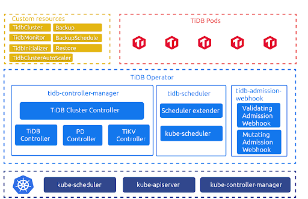

随着 TiDB Operator 社区的壮大，越来越多的开发者参与到了 TiDB Operator 的开发中。目前，TiDB Operator 的开发门槛比较高，需要开发者对 TiDB Operator 的代码进行详细阅读之后才能了解到项目的全貌。有鉴于此，我们希望系统性地介绍一下 TiDB Operator 的代码细节，为刚入门的开发者提供指导，提供一份长期的查阅手册。通过这一系列文章，我们希望能扫清 TiDB Operator 理解的障碍，让更多的创意在社区中萌发。

## TiDB Operator 的应用场景和能力定位

了解 TiDB Operator 处理的应用场景和专注的定位，有助于大家了解 TiDB Operator 代码的功能边界。

上图是 TiDB Operator 的架构。其中，TidbCluster、TidbMonitor、TidbInitializer、Backup、Restore、BackupSchedule、TidbClusterAutoScaler 是由 CRD（CustomResourceDefinition）定义的自定义资源。这些 CRD 分别描述以下信息:

- TidbCluster 用于描述用户期望的 TiDB 集群，

- TidbMonitor 用于描述用户期望的 TiDB 集群监控组件，

- TidbInitializer 用于描述用户期望的 TiDB 集群初始化 Job，

- Backup 用于描述用户期望的 TiDB 集群备份 Job，

- Restore 用于描述用户期望的 TiDB 集群恢复 Job，

- BackupSchedule 用于描述用户期望的 TiDB 集群周期性备份 Job，

- TidbClusterAutoScaler 用于描述用户期望的 TiDB 集群自动伸缩规则。

TiDB 集群的编排和调度逻辑则由下列组件负责：

- tidb-controller-manager 是一组 Kubernetes 上的自定义控制器。这些控制器会不断对比 TidbCluster 对象中记录的期望状态与 TiDB 集群的实际状态，并调整 Kubernetes 中的资源以驱动 TiDB 集群满足期望状态，并根据其他 CR 完成相应的控制逻辑，

- tidb-scheduler 是一个 Kubernetes 调度器扩展，它为 Kubernetes 调度器注入了 TiDB 集群拓扑特有的调度逻辑，

- tidb-admission-webhook 是一个 Kubernetes 动态准入控制器，完成 Pod、StatefulSet 等相关资源的修改、验证与运维。

TiDB 在 Kubernetes 上运行，借助了 Deployment，Statefulset，Service，PVC，ConfigMap 等 Kubernetes 原生的资源定义，通过对这些资源的配合使用来运维 TiDB。在 TiDB Operator 的帮助下，用户只需要描述 TiDB 集群的规格，如版本，实例数量等，而不需要考虑如何使用 Kubernetes 的资源。 用户可以使用 YAML 部署 Tidbcluster CR 和 TidbMonitor CR，TiDB Operator 会根据这些 CR 对象的配置要求，驱动 Kubernetes 内相应的资源满足用户的期望，最后在满足用户要求的状态下使得 TiDB 正常运行，对外提供正常服务。

TiDB Operator 是从什么角度给用户的运维操作带来了简化的呢? 举例来说，用户需要 3 个 PD 实例，但从配置角度，第一个 PD 实例需要初始化，第二个和第三个 PD 实例则需要加入刚初始化的实例，这样启动参数为 --initial-cluster 和 --join，这个配置就可以由 TiDB Operator 自动生成。

同时，运维中需要通过滚动更新实现 PD 在线升级，如果手工操作，既繁琐，又难以保证升级过程中不影响在线 PD 业务，在 Kubernetes 中需要使用 Statefulsets 的 UpdateStrategy.Partition 选项控制滚动更新的进度，结合对 PD 服务的监控逐个更新 PD 实例。TiDB Operator 则可以通过 PD API 自动迁移 Leader 并监控更新后的 Pod 是否能正常服务，自动化在线滚动更新流程。这些操作如果通过手动完成，既繁琐又极易出错，而我们将这些 TiDB 的运维逻辑编排进 TiDB Operator，帮助用户简化 TiDB 运维流程。

从实现上看，TiDB Operator 需要具备与两个系统交互的能力：一个是与 Kubernetes 交互，使 Kubernetes 侧的资源配置和操作能够满足 TiDB 正常运行的需求；另一个是 TiDB 组件的 API，即 Operator 需要从 PD 获取到集群内部的状态变化，完成 Kubernetes 这一侧相应的资源管理，也要能够根据用户需求调用 TiDB 集群的 API 来完成运维操作。许多小伙伴在已有的 Kubernetes 运维系统上集成 TiDB 运维能力时，希望获得一种从 TiDB 系统的视角与这两个系统交互的运维能力，TiDB Operator 便很好的完成了这一工作。

通过这一系列文档，我们也希望能帮你了解到 TiDB Operator 中的技术细节，方便你将 TiDB Operator 整合进你的业务系统。

## 内容概要

我们希望在源码阅读系列文章中讨论以下内容:

- TiDB Operator 简介 - 讨论 TiDB Operator 需要解决的问题。

- Operator 模式 - 讨论 TiDB Operator 的代码入口，运行逻辑，Reconcile 循环的触发。

- TiDB Operator 的组件 Reconcile Loop 设计 - 讨论 TiDB 组件的 Reconcile 
Loop 的通用设计，并介绍可能的拓展点。

- TiDB Operator 的 Feature 设计 - 讨论备份、Auto-Scaling,、Webhook、Advanced Statefulset、TiDB Scheduler、监控等特性的设计与实现。

- TiDB Operator 的质量管理 - 讨论 TiDB Operator 的质量保证措施，如单元测试、E2E测试。

## 读者可以收获什么

我们希望在以下场景对你提供帮助:

1. 帮助你“知其然，且知其所以然”，了解功能背后的实现，扫清对 TiDB Operator 的认知盲区，增进你的使用体验。

2. 在你希望为社区贡献新的功能时，我们希望能帮你找到研究相关问题的入口，了解要修改或新增的功能在哪些地方可以着手切入，实现你的需求。

3. 在你希望将 TiDB Operator 集成到自己的以 Kubernetes 为基础的运维系统时，我们希望通过介绍我们怎样管理 Kubernetes 资源，怎样与 TiDB 交互，方便你将 TiDB Operator 接入系统。

4. 学习 Operator 框架时，TiDB Operator 是很好的范本。目前 Kubernetes 社区有 Kubebuilder、Operator framework 等 Operator 框架，也有 controller-runtime 等封装较好的 controller 运行时，这些实现方法本质上都是利用 Kubernetes 已有的模块来封装复杂的运维逻辑。了解 TiDB Operator 的运行逻辑，可以帮你掌握基于 Declaritive API，借助 Kubernetes 的优秀实现设计更强大且更易于实现的资源管理系统。

## 小结

这篇文章中， 我们主要讨论了 TiDB Operator 需要解决的问题，以及接下来系列文章的规划。 在接下来的系列文章中，我们会深入到 TiDB Operator 代码设计之中，介绍 TiDB Operator 的代码结构、TiDB Operator 的运行逻辑、TiDB Operator 的功能实现细节、TiDB Operator 的质量管理，以及 TiDB Operator 在 Kubernetes 的 Operator 模式下的编写的经验。欢迎你通过 [#sig-k8s](https://slack.tidb.io/invite?team=tidb-community&channel=sig-k8s&ref=pingcap-tidb-operator) 或 [pingcap/tidb-operator](https://github.com/pingcap/tidb-operator) 与 TiDB Operator 社区交流互动。

