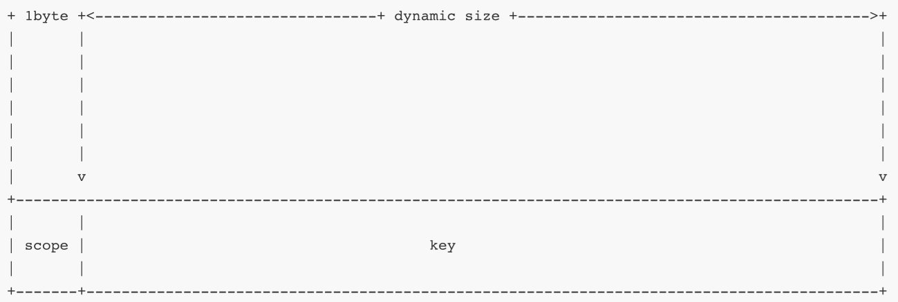
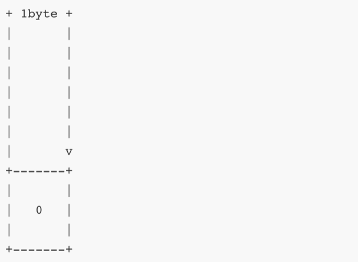
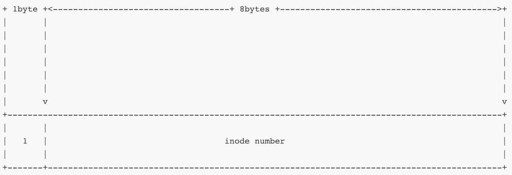
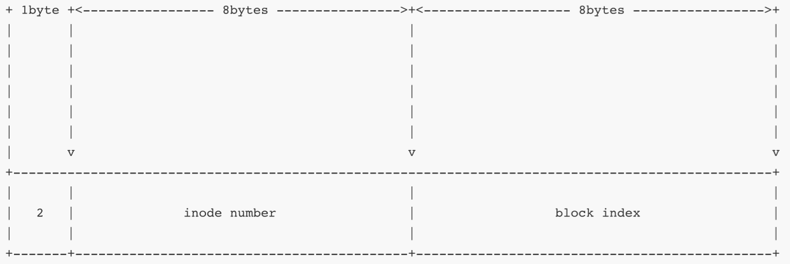
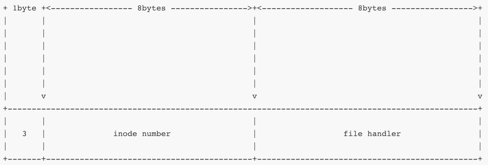
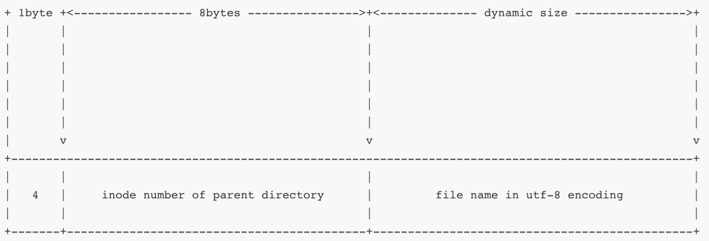
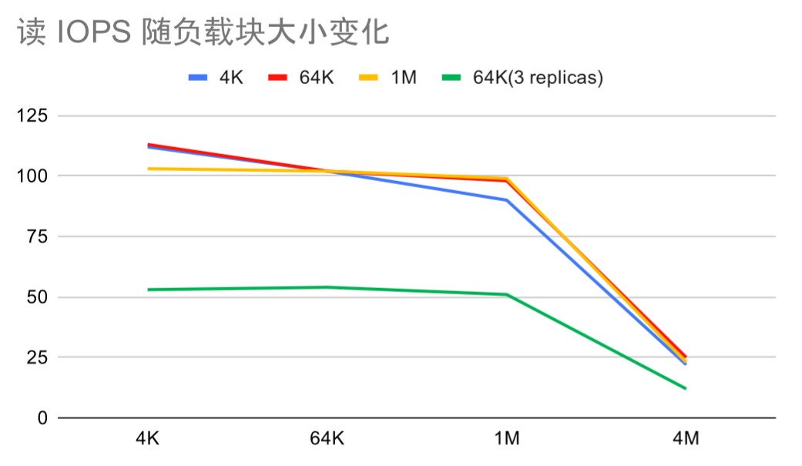
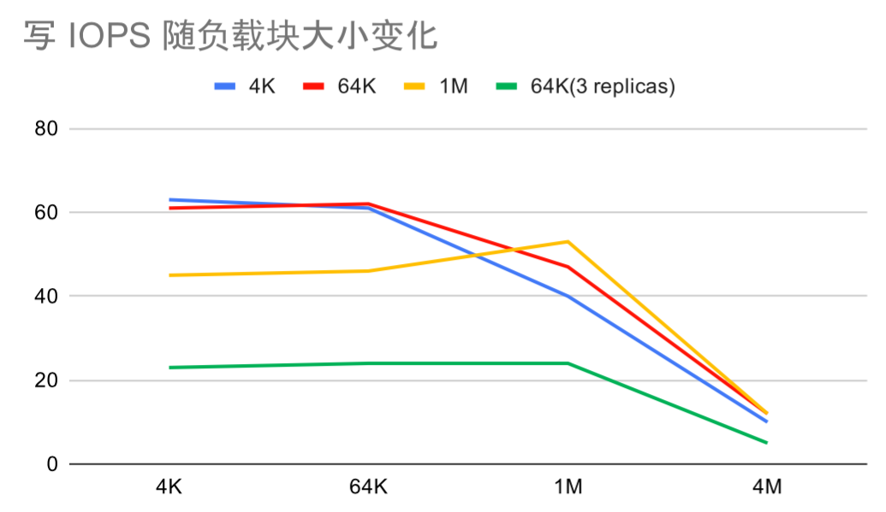
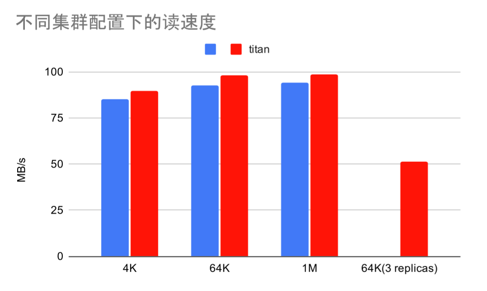
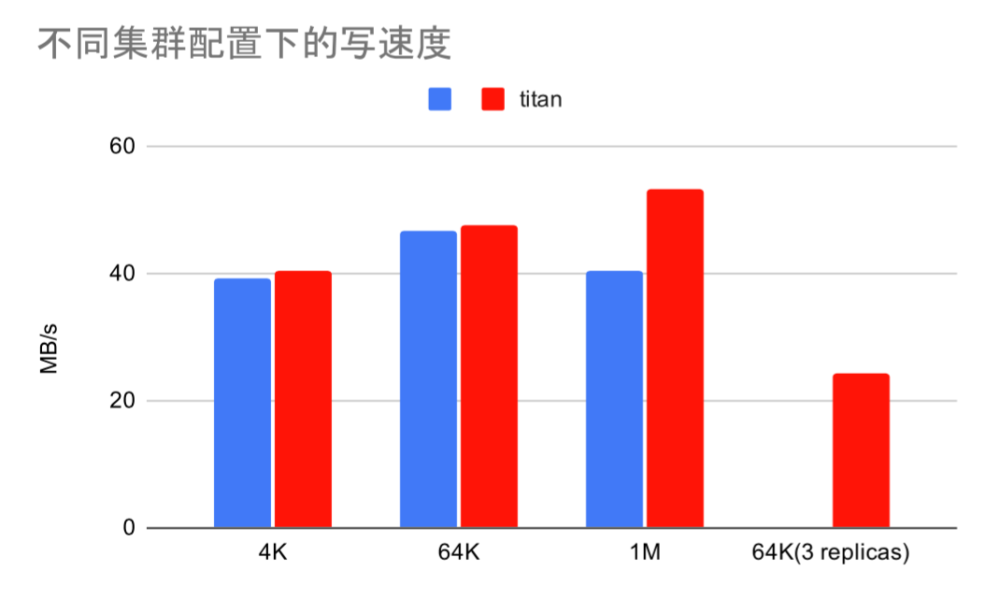

本篇文章的作者为龙姐姐说的都队的李晨曦，他们团队在本次 Hackathon 比赛中构建了一个基于 TiKV 的分布式 POSIX 文件系统 TiFS，继承了 TiKV 强大的分区容错和严格一致性特性，为 TiKV 生态开辟了一个新的领域。

## 起源

一次给朋友安利 TiDB 时，得知他只有一台机器，那跑 TiDB 集群有什么优势呢？我告诉他可以每块盘跑一个 TiKV 实例，这样实现了多磁盘容灾，就不需要组 RAID 了。

当然最后一句只是玩笑话，毕竟 TiDB 是个数据库，只能做到数据容灾。但转念一想，**如果把文件系统的数据也存进 TiKV，不就能做到文件系统容灾了吗？** 于是我们花了几天写出了 TiFS 的雏形 —— 一个充满 bug 经常死锁的 POSIX 文件系统，但令人兴奋的是这个想法确实可行。

雏形出来后，我们需要考虑更多的问题。比如文件系统基于 TiKV 的优势是什么？又比如 CAP 应该如何取舍？相比于常见的分布式文件系统存储后端，我认为 TiKV 最大的优势是天然支持分布式事务，基于此我们可以保证文件系统的**严格一致性**。如果我们要保证严格一致性，即我们要构建一个 CP 系统，那适用场景应当是通用 POSIX 文件系统，完全覆盖本地文件系统的需求，另外还能实现跨机器的文件协作或满足其它分布式应用的文件存储需求。
更酷的是，支持多实例协作的单机应用运行在 TiFS 上就可能变成分布式应用，比如 SQLite on TiFS 就是另一个**分布式关系型数据库**！


## 设计细节

### 值

TiFS 一共需要在 TiKV 中存储系统元数据（Meta）、文件元数据（Inode）、文件块（Block）、文件句柄（FileHandler）、符号链接（SymbolicLink）、目录（Directory）和文件索引（FileIndex）共七种值。其中文件块是用户写入的透明数据，符号链接只存储目标路径，而另外五种都是序列化的结构数据。

#### 系统元数据

系统元数据仅有一个用来生成文件序列号（inode number）的整数，其结构如下：

```Rust
struct Meta {
    inode_next: u64,
}
```

整个文件系统只有一份系统元数据，且仅在 `mknod` 和 `mkdir` 的过程中被更新。

#### 文件元数据

每个文件都有一份对应的文件元数据，其结构如下：

```rust
struct Inode {
    file_attr: FileAttr,
    lock_state: LockState,
    inline_data: Option<Vec<u8>>,
    next_fh: u64,
    opened_fh: u64,
}
```

其中 `file_attr` 字段中存储了 POSIX 文件系统所必要的元数据，比如文件序列号、文件大小、块数量等，详细结构可[参考文档](https://docs.rs/fuser/0.7.0/fuser/struct.FileAttr.html)；`lock_state` 字段存储了当前的上锁状态和持锁人，用于实现 `flock；inline_data` 字段可能会存储少量文件内容，用于提升小文件的读写性能；`next_fn` 字段是一个自增整数，用于生成文件句柄；`opened_fn` 字段用于记录打开状态的文件句柄数量。

#### 文件句柄

文件系统对用户的每次 open 调用生成一个文件句柄，仅用于存储句柄的读写限制，其结构如下：

```rust
struct FileHandler {
    flags: i32,
}
```

#### 目录

每个目录都需要存储一份子文件列表以实现 `readdir`，列表中的每一项都存储了一个子文件的文件序列号、文件名和文件类型，其结构如下：

```rust
type Directory = Vec<DirItem>;

struct DirItem {
    ino: u64,
    name: String,
    typ: FileType,
}
```

#### 文件索引

我们可以直接遍历目录来实现文件查找，但为每个文件链接创建索引显然是更高效的解决方案。每个文件索引仅含有目标文件的序列号，其结构如下：

```rust
struct Index {
    ino: u64,
}
```

### 键

TiKV 本身只提供简单的键值对存储，键和值都是不定长的字节数组，所以设计系统之前需要给键分逻辑区域。TiFS 一共有系统元数据、文件元数据、文件块、文件句柄和文件索引五种键，其中文件块类的键可以用来存储文件块数据、符号链接和目录，另外四种键都只用于存储前文提到的同名值。

我们根据第一个字节区分不同类的键，这个字节可称为键的域（scope）。键的字节数组通用布局如下：



#### 系统元数据

系统元数据域只有唯一键值对，其键的字节数组布局如下：



#### 文件元数据

文件元数据域的键仅含有大端序编码的文件序列号，这样所有的文件元数据都顺序地存储在 TiKV 上，可以在 [`statfs`](https://man7.org/linux/man-pages/man2/statfs.2.html) 操作时直接用 TiKV 的 `scan` 接口扫描出所有文件的元数据。

文件元数据键的字节数组布局如下：



#### 文件块

文件块域的键由文件序列号和块序列号的大端序编码构成，这样同一文件的所有的文件块都顺序地存储在 TiKV 上，可以在读取大段数据时直接使用 TiKV 的 `scan` 接口一次扫描出所需的文件块。

文件块键的字节数组布局如下：



#### 文件句柄

文件句柄域的键由文件序列号和句柄号的大端序编码构成，其字节数组布局如下：



#### 文件索引

文件索引的键由大端序编码的目录文件序列号和 utf-8 编码的文件名构成，其字节数组布局如下：



### 一致性

TiKV 同时支持乐观事务和悲观事务，但由于 Rust 版客户端只提供了实验性的悲观事务支持，以及无冲突情况下悲观事务性能较差，目前TiFS 只使用了**乐观事务**。

## 应用场景

TiFS 可以用于大文件存储，但它相比于现有的大文件存储方案没有特别的性能或存储效率上的优势，它的主要使用场景是**小文件读写和复杂的文件系统操作**。git 远程仓库可以直接使用 TiFS 存储项目并运行 git 任务，比如 rebase 或 cherry-pick，而无需先转存到本地文件系统；多节点应用读写同一文件时可以直接使用 flock 来解决冲突。它的空间管理无需复杂的 SDK 或 API 接入，只需要调用简单的文件系统 API 或 shell 脚本。

另外，像文章开头所说的，支持多实例协作的单机应用运行在 TiFS 上就可能变成分布式应用，如运行在 TiFS 上的 SQLite 就成了分布式关系型数据库。当然这种场景对单机应用本身的要求比较严苛，首先应用本身得支持单机多实例，另外尽量不依赖 page cache 或其它缓存以避免写入不可见。

## 测试与性能

目前我们还没有给 TiFS 写测试，开发过程中我们一直以 [pjdfstest](https://github.com/pjd/pjdfstest) 为正确性基准并最终通过了它。但 pjdfstest 并不能覆盖读写正确性和并发下正确性，后面需要再跟进其它的测试。

从理论上来说 TiFS 的读写性能的影响因素主要有三个：文件系统块大小、网络带宽延迟和负载块大小。下面我们给出了一份 [benchmark](https://github.com/Hexilee/tifs.benchmark) 的[结果](https://docs.google.com/spreadsheets/d/1QusW0FYAjLRzDN9LbMUTLvwuxtZvNz_g_1GIrwXnevc/edit?usp=sharing)，并针对读写 $IOPS$ 和读写速度作出了四张图表。

我们首先来讨论 $IOPS$ 的变化规律，如下两张图分别是顺序写 $IOPS$ 和顺序读 $IOPS$ 随负载块大小的变化，四条折线代表不同的文件系统块大小和数据副本数。





由于顺序读写的 IO 操作是线性的，每次 IO 操作都是一次 TiKV 事务。如果我们忽略每次 IO 操作之间的细微区别，那一次 IO 操作的耗时 $T$ 就是 $IOPS$ 的倒数，且 $T$ 由 FUSE 的 IO 耗时 $T_f$，TiFS 本身的逻辑耗时 $T_c$ 、 网络传输耗时 $T_n$ 和 TiKV 的逻辑耗时 $T_s$ 叠加而成。如果不考虑流式处理，耗时就是线性叠加，即 $T=T_f+T_c+T_n+T_s$,  $IOPS=1/T_f+T_c+T_n+T_s$。

只考虑读的情况，$T_f$ 与负载块大小正相关； $T_n$ 和 $T_s$ 跟负载块和文件系统块中的较大者正相关（因为 TiFS 每次 IO 操作必须读写文件块整数倍的数据），而更大的流量可能会造成更多的网络和磁盘 IO 耗时；$T_c$ 的理论变化规律未知。

> TiKV 是个非常复杂的系统，其内部也可分为逻辑耗时、磁盘 IO 耗时和网络耗时。本文在性能分析时暂且将 TiKV 简化，只考虑单副本的情况。

图读 $IOPS$ 随负载大小变化 中，文件块和负载块均为 $4K$ 时，随着负载的增大 $T_f$, $T_n$ 和 $T_s$ 都在增加，故 $IOPS$ 减小。文件块 $64K$ 和 $1M$ 的情况下，当负载块小于文件块，$T_n$ 和 $T_s$ 几乎不变，$T_f$ 增大，$IOPS$ 减小；当负载块大于文件块，$T_f$, $T_n$ 和 $T_s$ 都在增加，故 $IOPS$ 持续减少。变化折线大致符合预期。

> 图中横坐标为对数距离，且取样点过少，斜率仅供参考。

顺序写数据时，如果负载块小于文件块，则 TiFS 需要先读一个脏文件块，会造成额外的 $T_c$ 和 $T_n$。这一点在文件块比较大时比较明显。如图写 $IOPS$ 随负载大小变化 中，文件块 $1M$ 时 $IOPS$ 的极大值明显处于文件块与负载块相等时。

另外我们可以发现，负载块和文件块为 $4K$ 或 $64K$ 时的 $IOPS$ 的几乎相等的。此时每秒最小流量 $4K \times 110=440K$，每秒最大流量 $64K \times 100=6.25M$，对网络或者磁盘的压力很小。在流量足够小的情况下可以认为 $IOPS$ 到达到了上限，此时 $T_n$ 的主要影响因素变成了网络延迟（本机测试可以认为是 $0ms$）。特别在写 $IOPS$ 随负载大小变化 图中，文件块和负载块在 $4K$ 和 $64K$ 之间变化对 $IOPS$ 几乎无影响。我们称此时的 $T$ 为 TiFS 在当前网络环境下的**固有操作延迟**，它主要由 $T_c$ 和 $T_s$ 决定。TiFS 和 TiKV 的逻辑耗时造成了固有延迟，过高的固有延迟会造成小文件读写体验很糟糕，但具体的优化思路还需要进一步的 perf。

读写速度等于 $IOPS$ 与负载块的乘积，而 $IOPS$ 在负载块 $4K$ 到 $1M$ 之间没有剧烈变化，我们很容易就能看出负载块 $1M$ 时读写速度达到最大值。下面两张是负载块 $1M$ 时不同集群配置下的读写速度对比图。

> 文件块 $64K$ 下未开启 [Titan](https://github.com/tikv/titan) 的对比图已有单副本数据，三副本数据仅供参考，未进行重复对比。





我们可以看到写速度受**文件块大小和 Titan 的影响比较大**，读速度则几乎不受影响。文件块越小，TiKV 需要写入的键值对越多，导致了额外耗时；但文件块过大会导致 RocksDB 写入性能不佳，开启 Titan 可以减少不必要的值拷贝，明显提升性能。

## 未来

TiFS 在架构上存在的一个问题是文件块存储成本比较高。TiKV 采用多副本冗余，空间冗余率（实际占用空间/写入数据量）一般 3 起步；而像 HDFS 或 CephFS，JuiceFS 等支持 EC 冗余模式的分布式文件系统冗余率可降到 1.2 到 1.5 之间。EC 冗余在写入和重建数据时需要编解码，均需要额外的计算资源。其在写入时可以降低网络开销和存储成本，但重建时一次需要读取多个数据块，有额外的网络开销，**是一种牺牲部分读性能以降低写入时网络开销及存储成本的冗余策略**。

目前 TiKV 要支持 EC 冗余还比较困难，后面 TiFS 会尝试支持 EC 冗余的对象存储来存文件块以降低存储成本，但近期的工作还是集中在**正确性验证和性能调优**。正确性验证部分包括找其它的开源文件系统测试和自建测试。性能调优部分包括 TiFS 的本身的调优工作和 TiKV 的高性能使用，以降低固有延迟。如果你对[这个项目](https://github.com/Hexilee/tifs)感兴趣，欢迎来试用或讨论。
