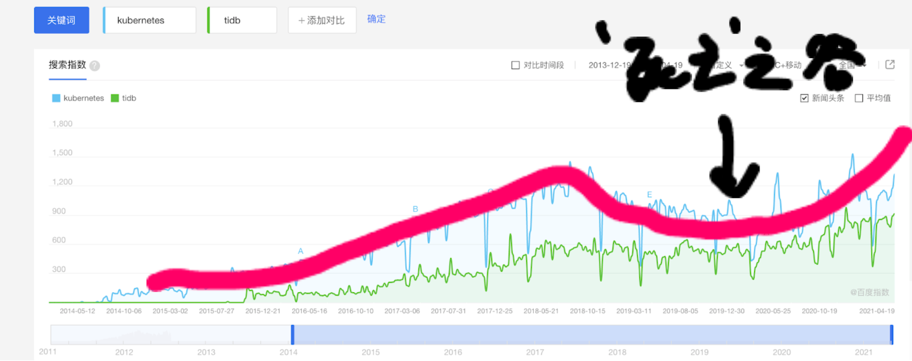
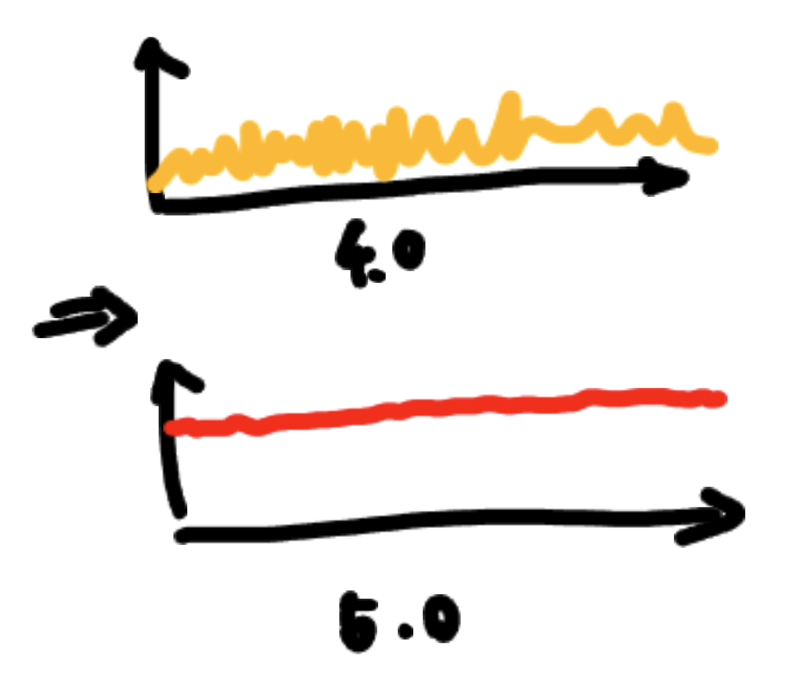
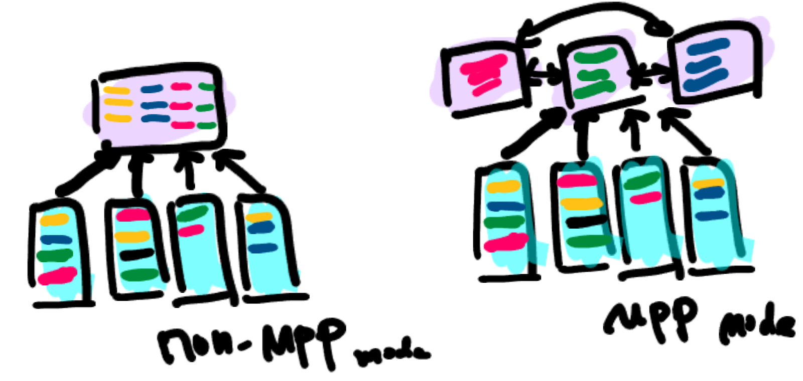

前不久，PingCAP 刚刚度过六岁生日。对于数据库这样一个古老的行业，六年只是刚刚起步。TiDB 5.0 的发布就像一个庆祝成长的生日礼物，为 TiDB 带来了一个具有里程碑意义的版本。通过引入 MPP （Massively Parallel Processing，大规模并行处理）架构，年轻的 TiDB 已经成为一款具备完整 HTAP 能力的分布式数据库。

**PingCAP 联合创始人兼 CTO 黄东旭在 TiDB 5.0 发布会上进行了《What’s Next? 新一代数据库的构想》的精彩演讲，讲述了 TiDB 作为一款企业级数据库的成长史，并分享 PingCAP 对于企业级数据库的思考与内外功修炼。**

## 一个企业级数据库的辛酸成长史

TiDB 从诞生的第一天起，就被设定了一个很高的目标——成为 **一款面向核心系统的企业级数据库。**也因为这个很高的目标，其发展历程充满着辛酸的故事。

5 年前，当带着 TiDB 第一个版本见客户时，还没有人用过 TiDB ，而客户的问题就是“有谁在用你的产品？” 很显然这段对话的结果就是被拒绝。毕竟作为一款企业级数据库，替换数据库的动作就像动心脏手术一样，客户通常都非常谨慎。

### TiDB 的第一次用户尝试就成为“救命”的产品

TiDB 的第一个用户是一家游戏公司，当时的数据库不能满足其广告投放系统的实时查询，于是就抱着死马当活马医的心态开始试用，结果 TiDB 成为救活这个公司的产品。说来也巧，这个广告系统恰好是一个 HTAP 场景，似乎也预示了 TiDB 的救命能力与实时性数据处理密不可分。

### 一个小目标：开拓金融行业客户

之后的几年中，随着在 Mobike 、今日头条等互联网创业企业中应用，TiDB 逐步成为互联网行业在分布式数据库领域的事实标准，也有了一些知名度。但熟悉的对话再次发生，客户在与 PingCAP 交流中问 “你们现在有没有金融行业的案例？”，当时 TiDB 还正处于 1.0 - 2.0 阶段，并没有金融行业案例，客户认为这还不算真正的企业级数据库。

到了 3.0 、4.0 版本时， TiDB 逐渐有了一些核心的金融行业客户，具备了金融客户使用案例。但客户又问 “你们有大行核心系统的应用案例吗？” “没有” “那不好意思，告辞！”

这段历史很辛酸，**每个人都有第一次，一个新产品也总得有第一个客户。** 但数据库这种东西所有人都说必须得别人用过，自己才敢用。这就是做企业级数据库的现状，因为这个东西实在太过于重要，没有人愿意当小白鼠。

## 从“救命” 到“省心放心” 企业级数据库的成熟之路

### TiDB 跨过最危险的开源鸿沟

TiDB 与很多数据库相比，很特别的一点在于它是一个开源软件。在业界，开源软件有一个跨越鸿沟的理论，它描绘了一个新技术的发展阶段：**一开始大家的预期都很高，逐渐有一些早期的用户，市场也在不断发出声音。持续一段时间后会经历一个高峰期，高峰过后就会进入一个很长时间没有增长的阶段。**很多开源项目死于这个死亡之谷，那是一段非常焦虑非常煎熬的时期。

上图中，蓝线代表 Kubernetes —— 目前全世界最流行的开源软件，从图中能明显看到它也经历过这样一个曲线。另外一条绿线代表了 TiDB ，作为一个历经六年的开源项目，也没有逃出这个客观规律。在中间长达两年的时间里几乎没有增长，这段时间对于一个开源数据库是最难熬的日子。从 4.0 版本发布至今，TiDB 终于跨过了这个最危险的开源鸿沟。根据开源的历史规律，TiDB 与 PingCAP 将会迎来一段高速的增长，现在已经是一个“死不了”的产品。在基础软件行业，一个死不了的开源软件已经很不容易了。

这个规律的背后说明了什么？**一个真正好用的基础软件，一款真正好用的企业级数据库，并不是几个天才工程师写出来的，而是被人“用”出来的。** 中间那段长达两年的，其实并不是没有增长，它只是在不停地进化，不断地在各种各样的场景中打磨产品。

回到 “什么是企业级数据库” 这个问题。有很多用户是通过数据库的用户案例来判断是否企业级，有的认为贵的软件收费就是企业级，也有很多人甚至觉得开源就不是企业级，每个人心中都有着不同的答案。

### 做“省心，放心，不担心”的企业级数据库

PingCAP 认为，**一个真正的企业级数据库厂商应该把自己放在用户的角度去思考，无论是一个企业去购买数据库应对数字化挑战，还是一个工程师去面对数百台的数据库集群维护，他们需要的就是“省心、放心、不担心“。**

**第一，省心。** 省心其实主要是易用性问题，很多时候，人们认为易用性是一个有关用户体验的事情。这里有一个特别简单的标准，如果它带来的问题要小于它解决的问题，这就是易用。如果你发现用一个新东西的时间和精力比它解决问题所花费的时间还多，那就是不省心。

**第二，放心。** 数据不会错、不会丢、性能无抖动是对于一个数据库最基础的要求。其实在使用数据库的过程里，并不在于它有多少功能、多高性能，而是万一出现问题，有没有人提供背后的企业级服务。一个 DBA 工作中可能有 50-60% 的时间在部署、安装、备份、维护数据库，如果这个数据库他不会运维，不知道怎么调优，就无法让人放心。PingCAP 背后有一支专业的服务团队，比起其他没有生态的数据库软件更能让人放心，维护不愁人。

**第三，不担心。** 用户到底在担心什么？是业务的增长吗？是数据量变大吗？是担心这家数据库公司倒闭吗？其实在数据库领域里，从用户的视角来看，真正的敌人是系统的复杂性，这个系统越复杂，在应对业务高速增长、快速变化时，应对的动作就会越迟缓。这个复杂性是各种各样的技术架构、各种各样的软件组合在一起，产生了很多的数据对接，以及维护各种各样的技术栈。

关于不担心，在 TiDB 里有一个真实的故事：

+ [视频](https://v.qq.com/x/page/k3242wd985n.html)

在传统的数据处理与大数据方案中，引入了各种各样的复杂性，用户的在线系统和离线大数据系统是完全割裂的两个系统。使用 TiDB 后，大多数场景用一套系统就可以支撑。对于用户来说，**一个简洁优雅的技术架构就是不用担心的方案。**

## 里程碑！TiDB 5.0 核心能力向企业级演进

### TiDB 5.0 的内功：TiDB，栈稳了！

如果要给 TiDB 5.0 定义一个关键字的话，那就是“练内功”。现在整个行业对于 TiDB 的认知和需求已经进入一个深水区，过去大家认为这是一个创新型产品，会在一些创新型的业务上用。但从 4.0 开始至今，越来越多的金融机构或大型企业，开始把 TiDB 用在一些非常关键、非常核心的交易、支付场景里。很多人表面上看 5.0 似乎并没有发布特别多新功能，其实在 5.0 这个版本能看到的显性功能只是冰山一角，冰山下面更多看不见的是 TiDB 产研团队、用户和贡献者对稳定性以及性能的持续优化，这些“内功”也是一个真正的企业级数据库应该追求的能力。

**从 4.0 版本到 5.0 版，TiDB 做了大量优化，包括减少性能抖动、提升性能、提升安全性等，上图中能看到这条黄色曲线最终变成了红色曲线，减少抖动将近 100 项。** 对于一个企业级数据库来说，内功其实是非常重要的一个壁垒。

### 真 HTAP 来了！TiDB 5.0 补全 HTAP 能力拼图

回顾整个 TiDB 历史，你可以看到 HTAP 是如何一步步变成今天这个形态的。TiDB 刚诞生的时候，出发点非常朴素，就是想做一个 MySQL 分库分表的替代品，比 MySQL 分库分表用起来更方便，解决 OLTP 规模化的问题。

4.0 版本已经实现初步的 HTAP 能力，第一次引入了 HTAP 的重要插件 —— 列式存储 TiFlash 引擎。列存引擎在底层为 TiDB 打下一个基础，与 OLAP 数据库相比不再有天生的缺陷。

TiDB 5.0 最新版在 TiFlash 的基础上引入了 MPP 架构，在功能上补全了 HTAP 最后一块拼图。**提供与存储匹配的分布式计算引擎，进一步提升海量数据下的并行计算与分析能力。** 这对于 TiDB 来说是一个里程碑，标志着 TiDB 成为一个拥有完整能力的 HTAP 分布式数据库。但里程碑并不代表终点，对于一个企业级数据库来说，TiDB 还有很长的路要走。前路漫漫，希望大家多多包容，多多呵护 TiDB 继续成长壮大。

## 抛掉过去，重新出发——数据库未来趋势

如果从数据库的发展历史角度来看，上世纪六七十年代，IBM、Oracle 发明了关系型数据库。2010 年前后，互联网普及了 Shared Nothing 架构，分布式数据库慢慢走向主流。现在基本一个成规模的互联网公司或者数据量大一点的公司，大多都在用 Shared Nothing 的数据库支撑。但从架构来说，我们也许需要新的思路来解决未来的问题。2021 年我们又站在了一个新十年时间窗口的开始，直觉告诉我们，接下来即将进入一个数据库技术的全新时代。这个时代需要抛弃掉过去所有对于数据库的假设，去面向这个时代的基础设施重新设计。

首先，**规模效应会重新掌握一切。** 早年间有一个预言说未来这个世界上只需要五台计算机，现在来看应该不是五台计算机，而是五朵云。云的基础设施也许会变成新的基础设施，未来的年轻一代工程师或许都不知道什么是 CPU、内存、磁盘，他们看到的基础设施就是云厂商提供的 API 或服务接口。从 Snowflake 的实践来看，新一代的基础软件只有基于云底层能力深度重构才能真正获取弹性的能力。Snowflake 是第一个，但是肯定不会是最后一个。

**未来可期，PingCAP 已经准备好重新出发！**